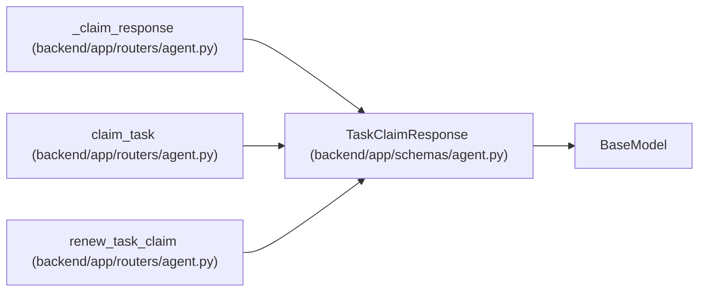

# TaskClaimResponse

**Location:** `backend/app/schemas/agent.py:257`
**Kind:** Pydantic model
**Bases:** `BaseModel`
**Module:** [schemas_agent](../modules/schemas_agent.md)

## Description

Response for task lease operations.

## Attributes

| Name | Type | Wire name | Required | Nullable | Default | Constraints | Examples | Description |
|------|------|-----------|----------|----------|---------|-------------|-------------|----------|
| `task` | `TaskResponse` | `task` | Yes | No | — | — | — | — |
| `claim_expires_at` | `datetime` | `claim_expires_at` | Yes | No | — | — | — | — |
| `claim_id` | `str` | `claim_id` | Yes | No | — | — | — | — |
| `claim_generation` | `int` | `claim_generation` | Yes | No | — | — | — | — |

## Methods

*No public methods. Inherits from base classes.*

## Relationships

<!-- Auto-generated relationship summary. Do not edit by hand. -->

### Summary

| Module | Methods | Attributes |
|---|---:|---|
| [schemas_agent](../modules/schemas_agent.md) | 0 | `claim_expires_at`, `claim_generation`, `claim_id`, `task` |

### Structure

| Kind | Entity | Module |
|---|---|---|
| Base | `BaseModel` | — |

### References

| Reference | Kind | Source | Call sites |
|---|---|---|---:|
| `_claim_response` | call | [routers_agent](../modules/routers_agent.md) | 1 |
| `_claim_response` | type_reference | [routers_agent](../modules/routers_agent.md) | — |
| `claim_task` | type_reference | [routers_agent](../modules/routers_agent.md) | — |
| `renew_task_claim` | type_reference | [routers_agent](../modules/routers_agent.md) | — |
