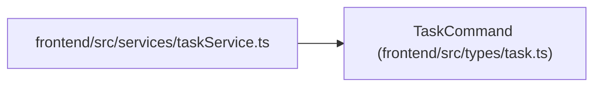

# TaskCommand

**Location:** `frontend/src/types/task.ts:462`
**Kind:** Class
**Bases:** —
**Module:** [types_task](../modules/types_task.md)

## Description

_Auto-generated from `TaskCommand` in `frontend/src/types/task.ts`._

## Attributes

| Name | Type | Required | Default | Description |
|------|------|----------|---------|-------------|
| `action` | `string` | Yes | — | — |
| `expected_version` | `number` | Yes | — | — |
| `reason` | `string` | Yes | — | — |
| `iteration_id` | `number` | No | — | — |
| `expected_claim_generation` | `number` | No | — | — |
| `expected_running_run_ids` | `number[]` | No | — | — |
| `expected_live_assignment_ids` | `number[]` | No | — | — |

## Methods

*No public methods. Inherits from base classes.*

## Relationships

<!-- Auto-generated relationship summary. Do not edit by hand. -->

### Summary

| Module | Methods | Attributes |
|---|---:|---|
| [types_task](../modules/types_task.md) | 0 | `action`, `expected_claim_generation`, `expected_live_assignment_ids`, `expected_running_run_ids`, `expected_version`, `iteration_id`, `reason` |

### References

| Reference | Kind | Source | Call sites |
|---|---|---|---:|
| `taskService` | import | [taskService](../modules/taskService.md) | — |
