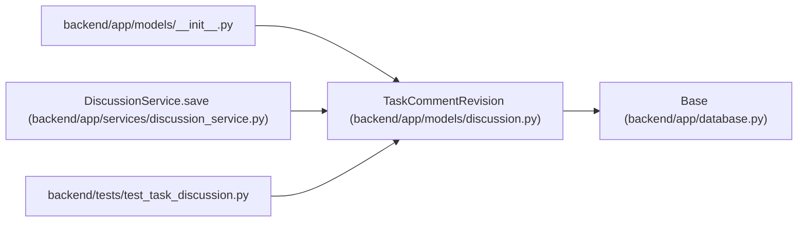

# TaskCommentRevision

**Location:** `backend/app/models/discussion.py:27`
**Kind:** Class
**Bases:** `Base`
**Module:** [models_discussion](../modules/models_discussion.md)

## Description

Append-only comment body, mention targets, attribution and removal state for one version. ORM mutation and deletion are rejected, and history remains scoped through the original task identity.

## Attributes

| Name | Type | Default | Description |
|------|------|---------|-------------|
| `id` | `Mapped[int]` | `mapped_column(Integer, primary_key=True)` | — |
| `comment_id` | `Mapped[int]` | `mapped_column(ForeignKey('task_comments.id', ondelete='RESTRICT'), index=True)` | — |
| `original_task_id` | `Mapped[int]` | `mapped_column(Integer, nullable=False, index=True)` | — |
| `principal_id` | `Mapped[int]` | `mapped_column(ForeignKey('principals.id', ondelete='RESTRICT'))` | — |
| `version` | `Mapped[int]` | `mapped_column(Integer, nullable=False)` | — |
| `body` | `Mapped[str]` | `mapped_column(Text, nullable=False)` | — |
| `mentions` | `Mapped[list]` | `mapped_column(JSON, nullable=False)` | — |
| `deleted` | `Mapped[bool]` | `mapped_column(nullable=False)` | — |
| `created_at` | `Mapped[datetime]` | `mapped_column(UTCDateTime(), nullable=False, default=utc_now)` | — |

## Methods

*No public methods. Inherits from base classes.*

## Relationships

<!-- Auto-generated relationship summary. Do not edit by hand. -->

### Summary

| Module | Methods | Attributes |
|---|---:|---|
| [models_discussion](../modules/models_discussion.md) | 0 | `body`, `comment_id`, `created_at`, `deleted`, `id`, `mentions`, `original_task_id`, `principal_id`, `version` |

### Structure

| Kind | Entity | Module |
|---|---|---|
| Base | `Base` | [app_database](../modules/app_database.md) |

### References

| Reference | Kind | Source | Call sites |
|---|---|---|---:|
| `__init__` | import | [models___init__](../modules/models___init__.md) | — |
| `DiscussionService.save` | call | [discussion_service](../modules/discussion_service.md) | 1 |
| `test_task_discussion` | import | [test_task_discussion](../modules/test_task_discussion.md) | — |
