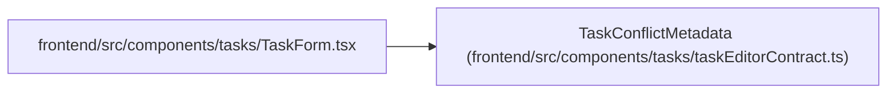

# TaskConflictMetadata

**Location:** `frontend/src/components/tasks/taskEditorContract.ts:251`
**Kind:** Class
**Bases:** —
**Module:** [taskEditorContract](../modules/taskEditorContract.md)

## Description

_Auto-generated from `TaskConflictMetadata` in `frontend/src/components/tasks/taskEditorContract.ts`._

## Attributes

| Name | Type | Default | Description |
|------|------|---------|-------------|
| `id` | `number` | *required* | — |
| `version` | `number` | *required* | — |
| `title` | `string` | *required* | — |
| `status` | `TaskStatus` | *required* | — |
| `updated_at` | `string \| null` | *required* | — |

## Methods

*No public methods. Inherits from base classes.*

## Relationships

<!-- Auto-generated relationship summary. Do not edit by hand. -->

### Summary

| Module | Methods | Attributes |
|---|---:|---|
| [taskEditorContract](../modules/taskEditorContract.md) | 0 | `id`, `status`, `title`, `updated_at`, `version` |

### References

| Reference | Kind | Source | Call sites |
|---|---|---|---:|
| `TaskForm` | import | [TaskForm](../modules/TaskForm.md) | — |
