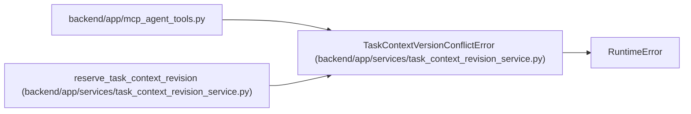

# TaskContextVersionConflictError

**Location:** `backend/app/services/task_context_revision_service.py:14`
**Kind:** Class
**Bases:** `RuntimeError`
**Module:** [task_context_revision_service](../modules/task_context_revision_service.md)

## Description

Raised when another transaction reserves the task context version first.

## Attributes

*No annotated attributes found.*

## Methods

*No public methods. Inherits from base classes.*

## Relationships

<!-- Auto-generated relationship summary. Do not edit by hand. -->

### Summary

| Module | Methods | Attributes |
|---|---:|---|
| [task_context_revision_service](../modules/task_context_revision_service.md) | 0 | — |

### Structure

| Kind | Entity | Module |
|---|---|---|
| Base | `RuntimeError` | — |

### References

| Reference | Kind | Source | Call sites |
|---|---|---|---:|
| `mcp_agent_tools` | import | [mcp_agent_tools](../modules/mcp_agent_tools.md) | — |
| `reserve_task_context_revision` | call | [task_context_revision_service](../modules/task_context_revision_service.md) | 1 |
