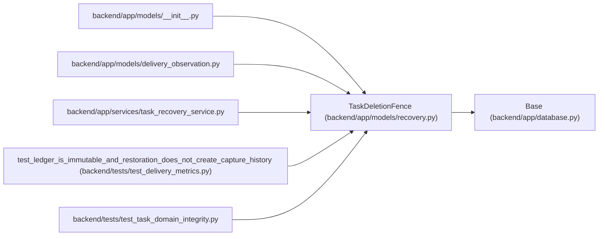

# TaskDeletionFence

**Location:** `backend/app/models/recovery.py:54`
**Kind:** Class
**Bases:** `Base`
**Module:** [recovery](../modules/recovery.md)

## Description

Retain the highest deleted task version independently of task lifetime.

The task deletion hook writes the highest observed task version to an independent table in the same ORM transaction, including cascaded children and removals during recovery. Rollback removes an uncommitted fence. A surviving fence protects later reuse of the task ID; the upgrade does not invent records for historical deletions.

## Attributes

| Name | Type | Default | Description |
|------|------|---------|-------------|
| `original_task_id` | `Mapped[int]` | `mapped_column(Integer, primary_key=True, autoincrement=False)` | — |
| `last_version` | `Mapped[int]` | `mapped_column(Integer, nullable=False)` | — |

## Methods

*No public methods. Inherits from base classes.*

## Relationships

<!-- Auto-generated relationship summary. Do not edit by hand. -->

### Summary

| Module | Methods | Attributes |
|---|---:|---|
| [recovery](../modules/recovery.md) | 0 | `last_version`, `original_task_id` |

### Structure

| Kind | Entity | Module |
|---|---|---|
| Base | `Base` | [app_database](../modules/app_database.md) |

### References

| Reference | Kind | Source | Call sites |
|---|---|---|---:|
| `__init__` | import | [models___init__](../modules/models___init__.md) | — |
| `delivery_observation` | import | [delivery_observation](../modules/delivery_observation.md) | — |
| `task_recovery_service` | import | [task_recovery_service](../modules/task_recovery_service.md) | — |
| `test_ledger_is_immutable_and_restoration_does_not_create_capture_history` | call | [test_delivery_metrics](../modules/test_delivery_metrics.md) | 1 |
| `test_task_domain_integrity` | import | [test_task_domain_integrity](../modules/test_task_domain_integrity.md) | — |
