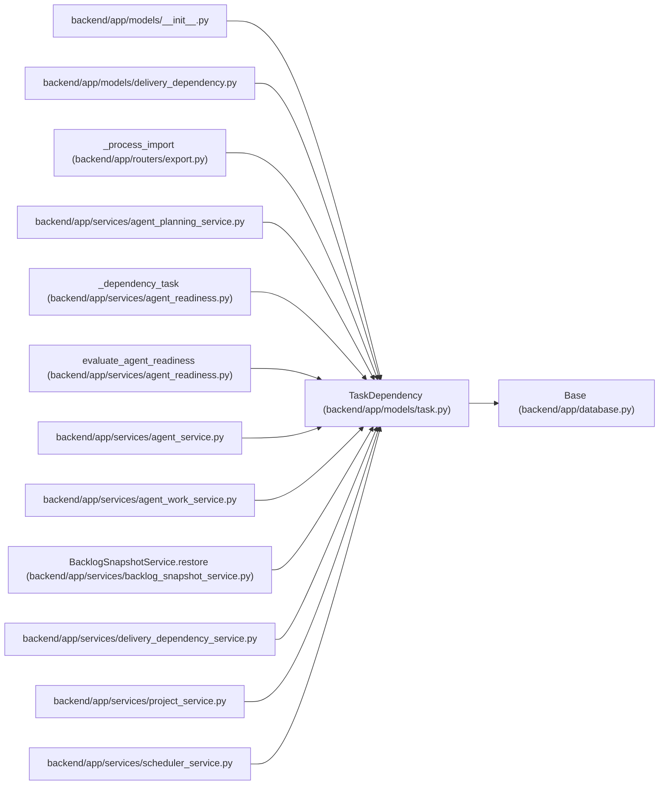

# TaskDependency

**Location:** `backend/app/models/task.py:257`
**Kind:** Class
**Bases:** `Base`
**Module:** [models_task](../modules/models_task.md)

## Description

Task dependency relationship (including cross-parent subtask dependencies).

## Attributes

| Name | Type | Default | Description |
|------|------|---------|-------------|
| `id` | `Mapped[int]` | `mapped_column(Integer, primary_key=True, autoincrement=True)` | — |
| `task_id` | `Mapped[int]` | `mapped_column(Integer, ForeignKey('tasks.id'), nullable=False)` | — |
| `depends_on_id` | `Mapped[int]` | `mapped_column(Integer, ForeignKey('tasks.id'), nullable=False)` | — |
| `task` | `Mapped['Task']` | `relationship('Task', foreign_keys=[task_id], back_populates='dependencies')` | — |
| `depends_on` | `Mapped['Task']` | `relationship('Task', foreign_keys=[depends_on_id], back_populates='dependents')` | — |

## Methods

*No public methods. Inherits from base classes.*

## Relationships

<!-- Auto-generated relationship summary. Do not edit by hand. -->

### Summary

| Module | Methods | Attributes |
|---|---:|---|
| [models_task](../modules/models_task.md) | 0 | `depends_on`, `depends_on_id`, `id`, `task`, `task_id` |

### Structure

| Kind | Entity | Module |
|---|---|---|
| Base | `Base` | [app_database](../modules/app_database.md) |

### References

| Reference | Kind | Source | Call sites |
|---|---|---|---:|
| `__init__` | import | [models___init__](../modules/models___init__.md) | — |
| `delivery_dependency` | import | [delivery_dependency](../modules/delivery_dependency.md) | — |
| `_process_import` | call | [export](../modules/export.md) | 1 |
| `agent_planning_service` | import | [agent_planning_service](../modules/agent_planning_service.md) | — |
| `_dependency_task` | type_reference | [agent_readiness](../modules/agent_readiness.md) | — |
| `evaluate_agent_readiness` | type_reference | [agent_readiness](../modules/agent_readiness.md) | — |
| `agent_service` | import | [agent_service](../modules/agent_service.md) | — |
| `agent_work_service` | import | [agent_work_service](../modules/agent_work_service.md) | — |
| `BacklogSnapshotService.restore` | call | [backlog_snapshot_service](../modules/backlog_snapshot_service.md) | 1 |
| `delivery_dependency_service` | import | [delivery_dependency_service](../modules/delivery_dependency_service.md) | — |
| `project_service` | import | [project_service](../modules/project_service.md) | — |
| `scheduler_service` | import | [scheduler_service](../modules/scheduler_service.md) | — |

> References: showing 12 of 21 logical references; 9 omitted by the 12-row generated summary limit.
