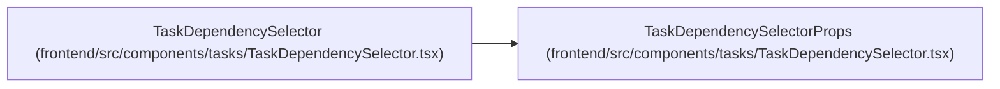

# TaskDependencySelectorProps

**Location:** `frontend/src/components/tasks/TaskDependencySelector.tsx:9`
**Kind:** Class
**Bases:** —
**Module:** [TaskDependencySelector](../modules/TaskDependencySelector.md)

## Description

_Auto-generated from `TaskDependencySelectorProps` in `frontend/src/components/tasks/TaskDependencySelector.tsx`._

## Attributes

| Name | Type | Default | Description |
|------|------|---------|-------------|
| `iterationId` | `number` | *required* | — |
| `currentTaskId` | `number` | *required* | — |
| `selectedIds` | `number[]` | *required* | — |
| `onChange` | `(ids: number[]) => void` | *required* | — |

## Methods

*No public methods. Inherits from base classes.*

## Relationships

<!-- Auto-generated relationship summary. Do not edit by hand. -->

### Summary

| Module | Methods | Attributes |
|---|---:|---|
| [TaskDependencySelector](../modules/TaskDependencySelector.md) | 0 | `currentTaskId`, `iterationId`, `onChange`, `selectedIds` |

### References

| Reference | Kind | Source | Call sites |
|---|---|---|---:|
| `TaskDependencySelector` | type_reference | [TaskDependencySelector](../modules/TaskDependencySelector.md) | — |
