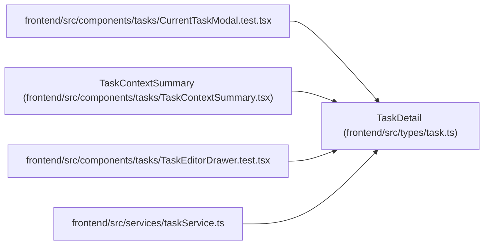

# TaskDetail

**Location:** `frontend/src/types/task.ts:463`
**Kind:** Class
**Bases:** —
**Module:** [types_task](../modules/types_task.md)

## Description

_Auto-generated from `TaskDetail` in `frontend/src/types/task.ts`._

## Attributes

| Name | Type | Required | Default | Description |
|------|------|----------|---------|-------------|
| `task` | `Task` | Yes | — | — |
| `ancestors` | `TaskReference[]` | Yes | — | — |
| `ancestors_complete` | `boolean` | Yes | — | — |
| `children` | `TaskReferencePage` | Yes | — | — |
| `dependencies` | `TaskReferencePage` | Yes | — | — |
| `execution_context_complete` | `false` | Yes | — | — |

## Methods

*No public methods. Inherits from base classes.*

## Relationships

<!-- Auto-generated relationship summary. Do not edit by hand. -->

### Summary

| Module | Methods | Attributes |
|---|---:|---|
| [types_task](../modules/types_task.md) | 0 | `ancestors`, `ancestors_complete`, `children`, `dependencies`, `execution_context_complete`, `task` |

### References

| Reference | Kind | Source | Call sites |
|---|---|---|---:|
| `CurrentTaskModal.test` | import | [CurrentTaskModal.test](../modules/CurrentTaskModal.test.md) | — |
| `TaskContextSummary` | type_reference | [TaskContextSummary](../modules/TaskContextSummary.md) | — |
| `TaskEditorDrawer.test` | import | [TaskEditorDrawer.test](../modules/TaskEditorDrawer.test.md) | — |
| `taskService` | import | [taskService](../modules/taskService.md) | — |
