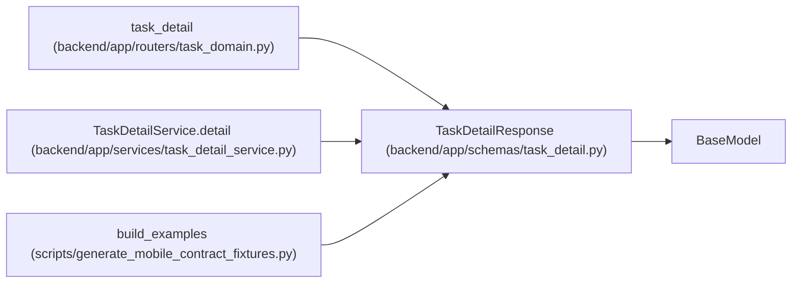

# TaskDetailResponse

**Location:** `backend/app/schemas/task_detail.py:34`
**Kind:** Pydantic model
**Bases:** `BaseModel`
**Module:** [task_detail](../modules/task_detail.md)

## Description

_Auto-generated from `TaskDetailResponse` in `backend/app/schemas/task_detail.py`._

## Attributes

| Name | Type | Wire name | Required | Nullable | Default | Constraints | Examples | Description |
|------|------|-----------|----------|----------|---------|-------------|-------------|----------|
| `task` | `TaskResponse` | `task` | Yes | No | — | — | — | — |
| `ancestors` | `list[TaskReference]` | `ancestors` | Yes | No | — | — | — | — |
| `ancestors_complete` | `bool` | `ancestors_complete` | Yes | No | — | — | — | — |
| `children` | `TaskReferencePage` | `children` | Yes | No | — | — | — | — |
| `dependencies` | `TaskReferencePage` | `dependencies` | Yes | No | — | — | — | — |
| `execution_context_complete` | `bool` | `execution_context_complete` | No | No | `False` | — | — | — |

## Methods

*No public methods. Inherits from base classes.*

## Relationships

<!-- Auto-generated relationship summary. Do not edit by hand. -->

### Summary

| Module | Methods | Attributes |
|---|---:|---|
| [task_detail](../modules/task_detail.md) | 0 | `ancestors`, `ancestors_complete`, `children`, `dependencies`, `execution_context_complete`, `task` |

### Structure

| Kind | Entity | Module |
|---|---|---|
| Base | `BaseModel` | — |

### References

| Reference | Kind | Source | Call sites |
|---|---|---|---:|
| `task_detail` | type_reference | [routers_task_domain](../modules/routers_task_domain.md) | — |
| `TaskDetailService.detail` | call | [task_detail_service](../modules/task_detail_service.md) | 1 |
| `build_examples` | call | [generate_mobile_contract_fixtures](../modules/generate_mobile_contract_fixtures.md) | 1 |
