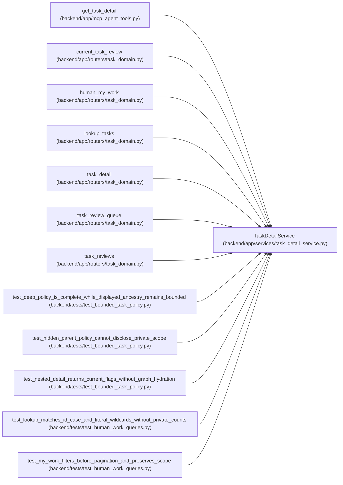

# TaskDetailService

**Location:** `backend/app/services/task_detail_service.py:12`
**Kind:** Class
**Bases:** —
**Module:** [task_detail_service](../modules/task_detail_service.md)

## Description

_Auto-generated from `TaskDetailService` in `backend/app/services/task_detail_service.py`._

## Attributes

*No annotated attributes found.*

## Methods

| Method | Signature | Decorators | Description |
|--------|-----------|------------|-------------|
| `__init__` | `(db)` | — | — |
| `_policy_flags` | *(async)* `(task_id)` | — | Observe only bounded parent identities and policy flags, without hydrating execution relationships. |
| `references` | `()` | `@staticmethod` | — |
| `page` | *(async)* `(query, *, limit = 50, after_id = 0)` | — | — |
| `lookup` | *(async)* `(*, project_id = None, iteration_id = None, query = None, backlog_only = False, limit = 50, after_id = 0, status = None, parent_id = None, roots_only = False)` | — | — |
| `my_work` | *(async)* `(*, limit = 50, after_id = 0, project_id = None, iteration_id = None, backlog_only = False)` | — | Bounded human ownership queues, independent of exact-agent assignment decisions. |
| `detail` | *(async)* `(task_id, *, limit = 50, children_after_id = 0, dependencies_after_id = 0)` | — | — |

## Relationships

<!-- Auto-generated relationship summary. Do not edit by hand. -->

### Summary

| Module | Methods | Attributes |
|---|---:|---|
| [task_detail_service](../modules/task_detail_service.md) | 7 | — |

### References

| Reference | Kind | Source | Call sites |
|---|---|---|---:|
| `get_task_detail` | call | [mcp_agent_tools](../modules/mcp_agent_tools.md) | 1 |
| `current_task_review` | call | [routers_task_domain](../modules/routers_task_domain.md) | 1 |
| `human_my_work` | call | [routers_task_domain](../modules/routers_task_domain.md) | 1 |
| `lookup_tasks` | call | [routers_task_domain](../modules/routers_task_domain.md) | 1 |
| `task_detail` | call | [routers_task_domain](../modules/routers_task_domain.md) | 1 |
| `task_review_queue` | call | [routers_task_domain](../modules/routers_task_domain.md) | 1 |
| `task_reviews` | call | [routers_task_domain](../modules/routers_task_domain.md) | 1 |
| `test_deep_policy_is_complete_while_displayed_ancestry_remains_bounded` | call | [test_bounded_task_policy](../modules/test_bounded_task_policy.md) | 1 |
| `test_hidden_parent_policy_cannot_disclose_private_scope` | call | [test_bounded_task_policy](../modules/test_bounded_task_policy.md) | 1 |
| `test_nested_detail_returns_current_flags_without_graph_hydration` | call | [test_bounded_task_policy](../modules/test_bounded_task_policy.md) | 1 |
| `test_lookup_matches_id_case_and_literal_wildcards_without_private_counts` | call | [test_human_work_queries](../modules/test_human_work_queries.md) | 1 |
| `test_my_work_filters_before_pagination_and_preserves_scope` | call | [test_human_work_queries](../modules/test_human_work_queries.md) | 1 |

> References: showing 12 of 19 logical references; 7 omitted by the 12-row generated summary limit.
