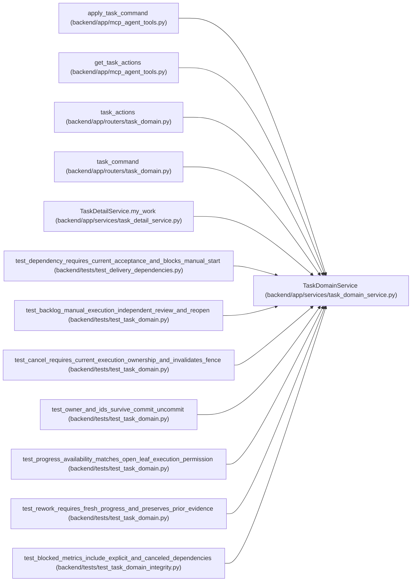

# TaskDomainService

**Location:** `backend/app/services/task_domain_service.py:151`
**Kind:** Class
**Bases:** —
**Module:** [task_domain_service](../modules/task_domain_service.md)

## Description

_Auto-generated from `TaskDomainService` in `backend/app/services/task_domain_service.py`._

## Attributes

*No annotated attributes found.*

## Methods

| Method | Signature | Decorators | Description |
|--------|-----------|------------|-------------|
| `__init__` | `(db)` | — | — |
| `tasks` | `()` | `@property` | — |
| `ownership` | *(async)* `(task_id, *, lock = False)` | — | — |
| `allowed_actions` | *(async)* `(task_id)` | — | — |
| `command` | *(async)* `(task_id: int, data: TaskActionRequest)` | `@atomic_command` | — |
| `_cancel_execution` | *(async)* `(task, data)` | — | — |
| `_commitment` | *(async)* `(task, data)` | — | — |

## Relationships

<!-- Auto-generated relationship summary. Do not edit by hand. -->

### Summary

| Module | Methods | Attributes |
|---|---:|---|
| [task_domain_service](../modules/task_domain_service.md) | 7 | — |

### References

| Reference | Kind | Source | Call sites |
|---|---|---|---:|
| `apply_task_command` | call | [mcp_agent_tools](../modules/mcp_agent_tools.md) | 1 |
| `get_task_actions` | call | [mcp_agent_tools](../modules/mcp_agent_tools.md) | 1 |
| `task_actions` | call | [routers_task_domain](../modules/routers_task_domain.md) | 1 |
| `task_command` | call | [routers_task_domain](../modules/routers_task_domain.md) | 1 |
| `TaskDetailService.my_work` | call | [task_detail_service](../modules/task_detail_service.md) | 1 |
| `test_dependency_requires_current_acceptance_and_blocks_manual_start` | call | [test_delivery_dependencies](../modules/test_delivery_dependencies.md) | 2 |
| `test_backlog_manual_execution_independent_review_and_reopen` | call | [test_task_domain](../modules/test_task_domain.md) | 3 |
| `test_cancel_requires_current_execution_ownership_and_invalidates_fence` | call | [test_task_domain](../modules/test_task_domain.md) | 3 |
| `test_owner_and_ids_survive_commit_uncommit` | call | [test_task_domain](../modules/test_task_domain.md) | 2 |
| `test_progress_availability_matches_open_leaf_execution_permission` | call | [test_task_domain](../modules/test_task_domain.md) | 1 |
| `test_rework_requires_fresh_progress_and_preserves_prior_evidence` | call | [test_task_domain](../modules/test_task_domain.md) | 1 |
| `test_blocked_metrics_include_explicit_and_canceled_dependencies` | call | [test_task_domain_integrity](../modules/test_task_domain_integrity.md) | 2 |

> References: showing 12 of 13 logical references; 1 omitted by the 12-row generated summary limit.
