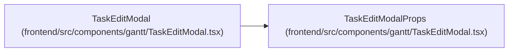

# TaskEditModalProps

**Location:** `frontend/src/components/gantt/TaskEditModal.tsx:15`
**Kind:** Class
**Bases:** —
**Module:** [TaskEditModal](../modules/TaskEditModal.md)

## Description

_Auto-generated from `TaskEditModalProps` in `frontend/src/components/gantt/TaskEditModal.tsx`._

## Attributes

| Name | Type | Default | Description |
|------|------|---------|-------------|
| `task` | `GanttTask \| null` | *required* | — |
| `iterationId` | `number` | *required* | — |
| `isOpen` | `boolean` | *required* | — |
| `onClose` | `() => void` | *required* | — |
| `sandboxMode` | `boolean` | *required* | — |
| `onSaveSandbox` | `(taskId: number, updatedData: Partial<GanttTask>) => void` | *required* | — |

## Methods

*No public methods. Inherits from base classes.*

## Relationships

<!-- Auto-generated relationship summary. Do not edit by hand. -->

### Summary

| Module | Methods | Attributes |
|---|---:|---|
| [TaskEditModal](../modules/TaskEditModal.md) | 0 | `isOpen`, `iterationId`, `onClose`, `onSaveSandbox`, `sandboxMode`, `task` |

### References

| Reference | Kind | Source | Call sites |
|---|---|---|---:|
| `TaskEditModal` | type_reference | [TaskEditModal](../modules/TaskEditModal.md) | — |
