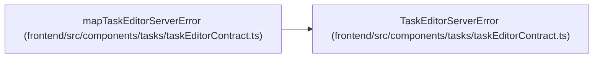

# TaskEditorServerError

**Location:** `frontend/src/components/tasks/taskEditorContract.ts:259`
**Kind:** Type alias
**Bases:** —
**Module:** [taskEditorContract](../modules/taskEditorContract.md)

## Description

_Auto-generated from `TaskEditorServerError` in `frontend/src/components/tasks/taskEditorContract.ts`._

## Attributes

*No annotated attributes found.*

## Methods

*No public methods. Inherits from base classes.*

## Relationships

<!-- Auto-generated relationship summary. Do not edit by hand. -->

### Summary

| Module | Methods | Attributes |
|---|---:|---|
| [taskEditorContract](../modules/taskEditorContract.md) | 0 | — |

### References

| Reference | Kind | Source | Call sites |
|---|---|---|---:|
| `mapTaskEditorServerError` | type_reference | [taskEditorContract](../modules/taskEditorContract.md) | — |
