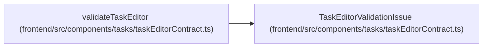

# TaskEditorValidationIssue

**Location:** `frontend/src/components/tasks/taskEditorContract.ts:194`
**Kind:** Class
**Bases:** —
**Module:** [taskEditorContract](../modules/taskEditorContract.md)

## Description

_Auto-generated from `TaskEditorValidationIssue` in `frontend/src/components/tasks/taskEditorContract.ts`._

## Attributes

| Name | Type | Required | Default | Description |
|------|------|----------|---------|-------------|
| `field` | `keyof TaskEditorValues` | Yes | — | — |
| `code` | `TaskEditorValidationCode` | Yes | — | — |

## Methods

*No public methods. Inherits from base classes.*

## Relationships

<!-- Auto-generated relationship summary. Do not edit by hand. -->

### Summary

| Module | Methods | Attributes |
|---|---:|---|
| [taskEditorContract](../modules/taskEditorContract.md) | 0 | `code`, `field` |

### References

| Reference | Kind | Source | Call sites |
|---|---|---|---:|
| `validateTaskEditor` | type_reference | [taskEditorContract](../modules/taskEditorContract.md) | — |
