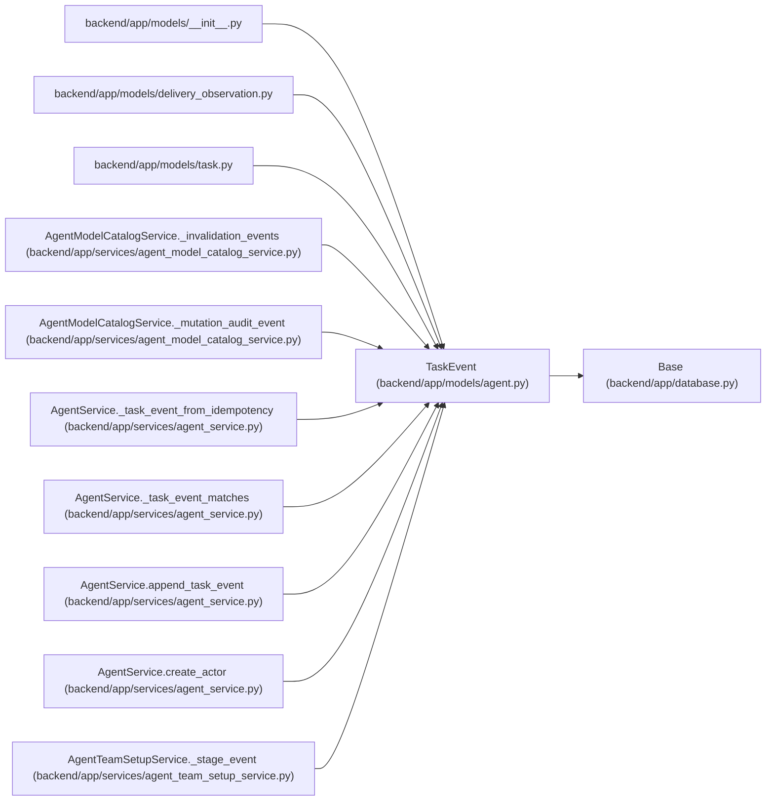

# TaskEvent

**Location:** `backend/app/models/agent.py:985`
**Kind:** Class
**Bases:** `Base`
**Module:** [models_agent](../modules/models_agent.md)

## Description

Append-only ledger entry for task mutations and agent checkpoints.

## Attributes

| Name | Type | Default | Description |
|------|------|---------|-------------|
| `id` | `Mapped[int]` | `mapped_column(Integer, primary_key=True, autoincrement=True)` | — |
| `task_id` | `Mapped[Optional[int]]` | `mapped_column(Integer, ForeignKey('tasks.id', ondelete='SET NULL'), nullable=True, index=True)` | — |
| `actor_type` | `Mapped[str]` | `mapped_column(String(50), default='user', nullable=False)` | — |
| `actor_id` | `Mapped[Optional[int]]` | `mapped_column(Integer, ForeignKey('agent_actors.id'), nullable=True, index=True)` | — |
| `event_type` | `Mapped[str]` | `mapped_column(String(100), nullable=False, index=True)` | — |
| `payload` | `Mapped[str]` | `mapped_column(Text, default='{}', nullable=False)` | — |
| `trace_id` | `Mapped[Optional[str]]` | `mapped_column(String(255), nullable=True, index=True)` | — |
| `span_id` | `Mapped[Optional[str]]` | `mapped_column(String(255), nullable=True)` | — |
| `correlation_id` | `Mapped[Optional[str]]` | `mapped_column(String(255), nullable=True, index=True)` | — |
| `idempotency_key` | `Mapped[Optional[str]]` | `mapped_column(String(255), nullable=True, index=True)` | — |
| `created_at` | `Mapped[datetime]` | `mapped_column(UTCDateTime(), default=utc_now, nullable=False, index=True)` | — |
| `task` | `Mapped[Optional['Task']]` | `relationship('Task', back_populates='events')` | — |
| `actor` | `Mapped[Optional['AgentActor']]` | `relationship('AgentActor', back_populates='task_events')` | — |

## Methods

*No public methods. Inherits from base classes.*

## Relationships

<!-- Auto-generated relationship summary. Do not edit by hand. -->

### Summary

| Module | Methods | Attributes |
|---|---:|---|
| [models_agent](../modules/models_agent.md) | 0 | `actor`, `actor_id`, `actor_type`, `correlation_id`, `created_at`, `event_type`, `id`, `idempotency_key`, `payload`, `span_id`, `task`, `task_id` |

### Structure

| Kind | Entity | Module |
|---|---|---|
| Base | `Base` | [app_database](../modules/app_database.md) |

### References

| Reference | Kind | Source | Call sites |
|---|---|---|---:|
| `__init__` | import | [models___init__](../modules/models___init__.md) | — |
| `delivery_observation` | import | [delivery_observation](../modules/delivery_observation.md) | — |
| `task` | import | [models_task](../modules/models_task.md) | — |
| `AgentModelCatalogService._invalidation_events` | call | [agent_model_catalog_service](../modules/agent_model_catalog_service.md) | 1 |
| `AgentModelCatalogService._invalidation_events` | type_reference | [agent_model_catalog_service](../modules/agent_model_catalog_service.md) | — |
| `AgentModelCatalogService._mutation_audit_event` | call | [agent_model_catalog_service](../modules/agent_model_catalog_service.md) | 1 |
| `AgentModelCatalogService._mutation_audit_event` | type_reference | [agent_model_catalog_service](../modules/agent_model_catalog_service.md) | — |
| `AgentService._task_event_from_idempotency` | type_reference | [agent_service](../modules/agent_service.md) | — |
| `AgentService._task_event_matches` | type_reference | [agent_service](../modules/agent_service.md) | — |
| `AgentService.append_task_event` | type_reference | [agent_service](../modules/agent_service.md) | — |
| `AgentService.create_actor` | call | [agent_service](../modules/agent_service.md) | 1 |
| `AgentTeamSetupService._stage_event` | call | [agent_team_setup_service](../modules/agent_team_setup_service.md) | 1 |

> References: showing 12 of 24 logical references; 12 omitted by the 12-row generated summary limit.
