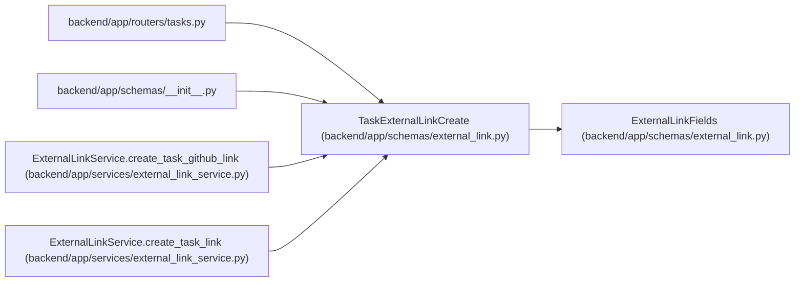

# TaskExternalLinkCreate

**Location:** `backend/app/schemas/external_link.py:69`
**Kind:** Pydantic model
**Bases:** `ExternalLinkFields`
**Module:** [schemas_external_link](../modules/schemas_external_link.md)

## Description

Schema for creating an external link on a task.

## Model Configuration

| Setting | Value | Source |
|---------|-------|--------|
| `extra` | `'forbid'` | model_config |

## Attributes

*No annotated attributes found.*

## Methods

*No public methods. Inherits from base classes.*

## Relationships

<!-- Auto-generated relationship summary. Do not edit by hand. -->

### Summary

| Module | Methods | Attributes |
|---|---:|---|
| [schemas_external_link](../modules/schemas_external_link.md) | 0 | — |

### Structure

| Kind | Entity | Module |
|---|---|---|
| Base | `ExternalLinkFields` | [schemas_external_link](../modules/schemas_external_link.md) |

### References

| Reference | Kind | Source | Call sites |
|---|---|---|---:|
| `tasks` | import | [tasks](../modules/tasks.md) | — |
| `__init__` | import | [schemas___init__](../modules/schemas___init__.md) | — |
| `ExternalLinkService.create_task_github_link` | call | [external_link_service](../modules/external_link_service.md) | 1 |
| `ExternalLinkService.create_task_link` | type_reference | [external_link_service](../modules/external_link_service.md) | — |
