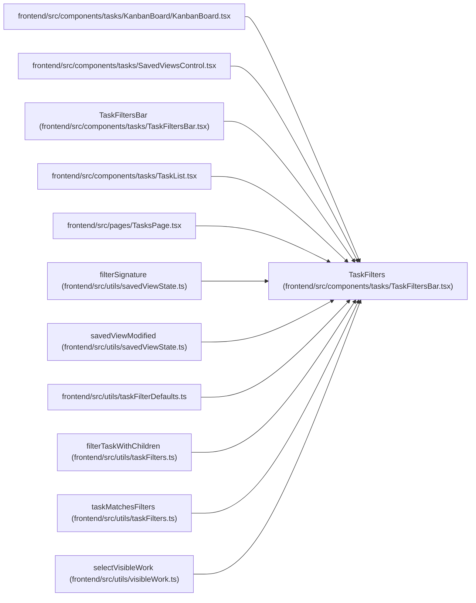

# TaskFilters

**Location:** `frontend/src/components/tasks/TaskFiltersBar.tsx:15`
**Kind:** Class
**Bases:** —
**Module:** [TaskFiltersBar](../modules/TaskFiltersBar.md)

## Description

_Auto-generated from `TaskFilters` in `frontend/src/components/tasks/TaskFiltersBar.tsx`._

## Attributes

| Name | Type | Required | Default | Description |
|------|------|----------|---------|-------------|
| `planningIssue` | `PlanningTaskIssue \| null` | Yes | — | — |
| `assigneeId` | `number \| null` | Yes | — | — |
| `projectId` | `number \| null` | Yes | — | — |
| `priority` | `number \| null` | Yes | — | — |
| `status` | `string \| null` | Yes | — | — |
| `hasDependency` | `boolean \| null` | Yes | — | — |
| `isOverdue` | `boolean \| null` | Yes | — | — |
| `isIterationOverflow` | `boolean \| null` | No | — | — |
| `agentReady` | `boolean \| null` | Yes | — | — |
| `startDateFrom` | `string` | Yes | — | — |
| `startDateTo` | `string` | Yes | — | — |
| `endDateFrom` | `string` | Yes | — | — |
| `endDateTo` | `string` | Yes | — | — |
| `labelSlugs` | `string[]` | Yes | — | — |
| `labelGroupKeys` | `string[]` | Yes | — | — |

## Methods

*No public methods. Inherits from base classes.*

## Relationships

<!-- Auto-generated relationship summary. Do not edit by hand. -->

### Summary

| Module | Methods | Attributes |
|---|---:|---|
| [TaskFiltersBar](../modules/TaskFiltersBar.md) | 0 | `agentReady`, `assigneeId`, `endDateFrom`, `endDateTo`, `hasDependency`, `isIterationOverflow`, `isOverdue`, `labelGroupKeys`, `labelSlugs`, `planningIssue`, `priority`, `projectId` |

### References

| Reference | Kind | Source | Call sites |
|---|---|---|---:|
| `KanbanBoard` | import | [KanbanBoard](../modules/KanbanBoard.md) | — |
| `SavedViewsControl` | import | [SavedViewsControl](../modules/SavedViewsControl.md) | — |
| `TaskFiltersBar` | type_reference | [TaskFiltersBar](../modules/TaskFiltersBar.md) | — |
| `TaskList` | import | [TaskList](../modules/TaskList.md) | — |
| `TasksPage` | import | [TasksPage](../modules/TasksPage.md) | — |
| `filterSignature` | type_reference | [savedViewState](../modules/savedViewState.md) | — |
| `savedViewModified` | type_reference | [savedViewState](../modules/savedViewState.md) | — |
| `taskFilterDefaults` | import | [taskFilterDefaults](../modules/taskFilterDefaults.md) | — |
| `filterTaskWithChildren` | type_reference | [taskFilters](../modules/taskFilters.md) | — |
| `taskMatchesFilters` | type_reference | [taskFilters](../modules/taskFilters.md) | — |
| `selectVisibleWork` | type_reference | [visibleWork](../modules/visibleWork.md) | — |
