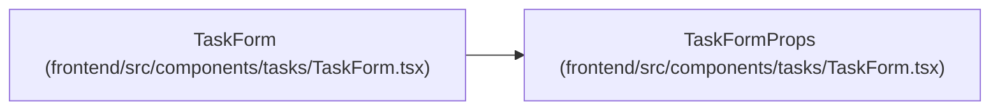

# TaskFormProps

**Location:** `frontend/src/components/tasks/TaskForm.tsx:47`
**Kind:** Class
**Bases:** —
**Module:** [TaskForm](../modules/TaskForm.md)

## Description

_Auto-generated from `TaskFormProps` in `frontend/src/components/tasks/TaskForm.tsx`._

## Attributes

| Name | Type | Default | Description |
|------|------|---------|-------------|
| `iterationId` | `number` | *required* | — |
| `initialData` | `Task` | *required* | — |
| `parentId` | `number \| null` | *required* | — |
| `parentPriority` | `number` | *required* | — |
| `parentProjectId` | `number \| null` | *required* | — |
| `parentMilestoneId` | `number \| null` | *required* | — |
| `onSuccess` | `() => void` | *required* | — |
| `onCancel` | `() => void` | *required* | — |
| `mode` | `'direct' \| 'sandbox'` | *required* | — |
| `onSaveSandbox` | `(update: TaskUpdate) => void` | *required* | — |
| `onDirtyChange` | `(dirty: boolean) => void` | *required* | — |
| `onPendingChange` | `(pending: boolean) => void` | *required* | — |
| `onDiscardReady` | `(handler: (() => void) \| null) => void` | *required* | — |
| `confirmUnsavedOnCancel` | `boolean` | *required* | — |

## Methods

*No public methods. Inherits from base classes.*

## Relationships

<!-- Auto-generated relationship summary. Do not edit by hand. -->

### Summary

| Module | Methods | Attributes |
|---|---:|---|
| [TaskForm](../modules/TaskForm.md) | 0 | `confirmUnsavedOnCancel`, `initialData`, `iterationId`, `mode`, `onCancel`, `onDirtyChange`, `onDiscardReady`, `onPendingChange`, `onSaveSandbox`, `onSuccess`, `parentId`, `parentMilestoneId` |

### References

| Reference | Kind | Source | Call sites |
|---|---|---|---:|
| `TaskForm` | type_reference | [TaskForm](../modules/TaskForm.md) | — |
