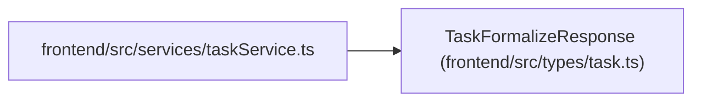

# TaskFormalizeResponse

**Location:** `frontend/src/types/task.ts:193`
**Kind:** Class
**Bases:** —
**Module:** [types_task](../modules/types_task.md)

## Description

_Auto-generated from `TaskFormalizeResponse` in `frontend/src/types/task.ts`._

## Attributes

| Name | Type | Default | Description |
|------|------|---------|-------------|
| `original_title` | `string` | *required* | — |
| `formalized_title` | `string` | *required* | — |
| `suggested_description` | `string` | *required* | — |
| `language` | `'en' \| 'ru'` | *required* | — |
| `suggested_effort_days` | `number \| null` | *required* | — |
| `suggested_subtasks` | `SuggestedSubtask[]` | *required* | — |

## Methods

*No public methods. Inherits from base classes.*

## Relationships

<!-- Auto-generated relationship summary. Do not edit by hand. -->

### Summary

| Module | Methods | Attributes |
|---|---:|---|
| [types_task](../modules/types_task.md) | 0 | `formalized_title`, `language`, `original_title`, `suggested_description`, `suggested_effort_days`, `suggested_subtasks` |

### References

| Reference | Kind | Source | Call sites |
|---|---|---|---:|
| `taskService` | import | [taskService](../modules/taskService.md) | — |
