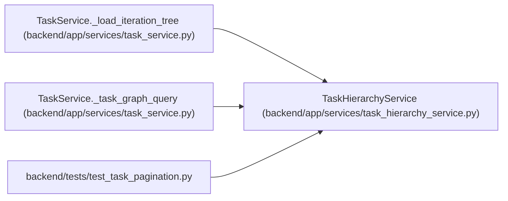

# TaskHierarchyService

**Location:** `backend/app/services/task_hierarchy_service.py:13`
**Kind:** Class
**Bases:** —
**Module:** [task_hierarchy_service](../modules/task_hierarchy_service.md)

## Description

_Auto-generated from `TaskHierarchyService` in `backend/app/services/task_hierarchy_service.py`._

## Attributes

*No annotated attributes found.*

## Methods

| Method | Signature | Decorators | Description |
|--------|-----------|------------|-------------|
| `__init__` | `(db, load_owner_names)` | — | — |
| `_task_graph_query` | `(iteration_id: int \| None, project_id: int \| None = None)` | — | Build the bounded relationship query used before in-memory tree assembly. |
| `_load_iteration_tree` | *(async)* `(iteration_id: int, *, max_tasks: int = MAX_ITERATION_TREE_TASKS, project_id: int \| None = None) -> tuple[list[Task], dict[int, Task]]` | — | Load and defensively assemble a contract-bounded iteration. |

## Relationships

<!-- Auto-generated relationship summary. Do not edit by hand. -->

### Summary

| Module | Methods | Attributes |
|---|---:|---|
| [task_hierarchy_service](../modules/task_hierarchy_service.md) | 3 | — |

### References

| Reference | Kind | Source | Call sites |
|---|---|---|---:|
| `TaskService._load_iteration_tree` | call | [task_service](../modules/task_service.md) | 1 |
| `TaskService._task_graph_query` | call | [task_service](../modules/task_service.md) | 1 |
| `test_task_pagination` | import | [test_task_pagination](../modules/test_task_pagination.md) | — |
