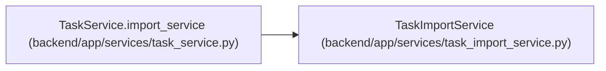

# TaskImportService

**Location:** `backend/app/services/task_import_service.py:21`
**Kind:** Class
**Bases:** —
**Module:** [task_import_service](../modules/task_import_service.md)

## Description

Own task text parsing, assignee resolution, and import persistence.

## Attributes

*No annotated attributes found.*

## Methods

| Method | Signature | Decorators | Description |
|--------|-----------|------------|-------------|
| `__init__` | `(db: AsyncSession, task_service: 'TaskService')` | — | — |
| `_parsed_task_has_complete_planning_fields` | `(parsed_task) -> bool` | `@staticmethod` | Return whether a parsed new row has enough detail to create a task. |
| `_normalize_import_assignee_name` | `(value: Optional[str]) -> Optional[str]` | `@staticmethod` | Normalize assignee tokens from task text imports. |
| `_get_team_member_lookup` | *(async)* `(iteration_id: int) -> tuple[dict[str, int], set[str]]` | — | Build a team member name to ID lookup for imports. |
| `_resolve_import_assignee_id` | `(assignee_name: Optional[str], name_to_member_id: dict[str, int], ambiguous_names: set[str], *, line_label: str) -> Optional[int]` | — | Resolve an executable task import assignee inside the target iteration. |
| `_task_from_parsed_import` | `(iteration_id: int, parsed_task, assignee_id: Optional[int], sort_order: int, project_id: Optional[int] = None, nominal_day_hours: float = 8) -> Task` | `@staticmethod` | Build a task model from parsed import data. |
| `_triage_item_from_parsed_import` | `(iteration_id: int, parsed_task, source: str, labels: list[str]) -> TriageItem` | `@staticmethod` | Build a triage item model from parsed import data. |
| `_record_triage_import_events` | *(async)* `(triage_items: list[TriageItem]) -> None` | — | Record audit events for triage items created from task import paths. |
| `import_tasks` | *(async)* `(iteration_id: int, text: str, destination: TaskImportDestination = 'tasks', *, expected_revision: int \| None = None) -> tuple[list[Task], list[TriageItem]]` | `@atomic_command` | Import task text into executable tasks, triage items, or both by policy. |
| `get_tasks_as_text` | *(async)* `(iteration_id: int) -> str` | — | Serialize every task in an iteration to the editable text format. |
| `bulk_update_tasks_from_text` | *(async)* `(iteration_id: int, text: str, destination: TaskImportDestination = 'tasks', *, expected_revision: int \| None = None) -> tuple[list[Task], list[TriageItem]]` | `@atomic_command` | Update ID-tagged tasks and create new tasks or triage items from text. |

## Relationships

<!-- Auto-generated relationship summary. Do not edit by hand. -->

### Summary

| Module | Methods | Attributes |
|---|---:|---|
| [task_import_service](../modules/task_import_service.md) | 11 | — |

### References

| Reference | Kind | Source | Call sites |
|---|---|---|---:|
| `TaskService.import_service` | call | [task_service](../modules/task_service.md) | 1 |
