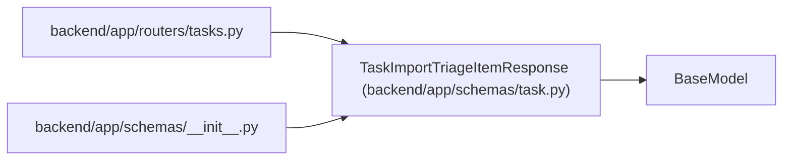

# TaskImportTriageItemResponse

**Location:** `backend/app/schemas/task.py:342`
**Kind:** Pydantic model
**Bases:** `BaseModel`
**Module:** [schemas_task](../modules/schemas_task.md)

## Description

Triage item shape returned by task import endpoints.

## Model Configuration

| Setting | Value | Source |
|---------|-------|--------|
| `from_attributes` | `True` | config_class |

## Attributes

| Name | Type | Wire name | Required | Nullable | Default | Constraints | Examples | Description |
|------|------|-----------|----------|----------|---------|-------------|-------------|----------|
| `id` | `int` | `id` | Yes | No | — | — | — | — |
| `title` | `str` | `title` | Yes | No | — | — | — | — |
| `description` | `Optional[str]` | `description` | No | Yes | `None` | — | — | — |
| `source` | `Optional[str]` | `source` | No | Yes | `None` | — | — | — |
| `source_url` | `Optional[str]` | `source_url` | No | Yes | `None` | — | — | — |
| `external_key` | `Optional[str]` | `external_key` | No | Yes | `None` | — | — | — |
| `status` | `str` | `status` | Yes | No | — | — | — | — |
| `priority_hint` | `Optional[int]` | `priority_hint` | No | Yes | `None` | — | — | — |
| `assignee_hint` | `Optional[str]` | `assignee_hint` | No | Yes | `None` | — | — | — |
| `project_hint_id` | `Optional[int]` | `project_hint_id` | No | Yes | `None` | — | — | — |
| `iteration_hint_id` | `Optional[int]` | `iteration_hint_id` | No | Yes | `None` | — | — | — |
| `labels` | `list[str]` | `labels` | No | No | factory: `list` | — | — | — |
| `snoozed_until` | `Optional[datetime]` | `snoozed_until` | No | Yes | `None` | — | — | — |
| `duplicate_of_id` | `Optional[int]` | `duplicate_of_id` | No | Yes | `None` | — | — | — |
| `duplicate_task_id` | `Optional[int]` | `duplicate_task_id` | No | Yes | `None` | — | — | — |
| `converted_task_id` | `Optional[int]` | `converted_task_id` | No | Yes | `None` | — | — | — |
| `created_at` | `datetime` | `created_at` | Yes | No | — | — | — | — |
| `updated_at` | `datetime` | `updated_at` | Yes | No | — | — | — | — |

## Methods

*No public methods. Inherits from base classes.*

## Relationships

<!-- Auto-generated relationship summary. Do not edit by hand. -->

### Summary

| Module | Methods | Attributes |
|---|---:|---|
| [schemas_task](../modules/schemas_task.md) | 0 | `assignee_hint`, `converted_task_id`, `created_at`, `description`, `duplicate_of_id`, `duplicate_task_id`, `external_key`, `id`, `iteration_hint_id`, `labels`, `priority_hint`, `project_hint_id` |

### Structure

| Kind | Entity | Module |
|---|---|---|
| Base | `BaseModel` | — |

### References

| Reference | Kind | Source | Call sites |
|---|---|---|---:|
| `tasks` | import | [tasks](../modules/tasks.md) | — |
| `__init__` | import | [schemas___init__](../modules/schemas___init__.md) | — |
