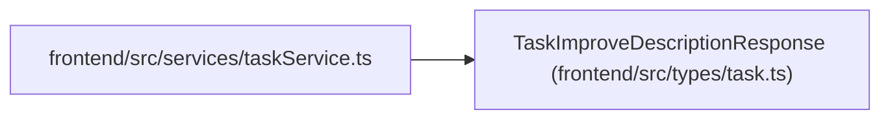

# TaskImproveDescriptionResponse

**Location:** `frontend/src/types/task.ts:223`
**Kind:** Class
**Bases:** —
**Module:** [types_task](../modules/types_task.md)

## Description

_Auto-generated from `TaskImproveDescriptionResponse` in `frontend/src/types/task.ts`._

## Attributes

| Name | Type | Required | Default | Description |
|------|------|----------|---------|-------------|
| `improved_description` | `string` | Yes | — | — |
| `language` | `'en' \| 'ru'` | No | — | — |

## Methods

*No public methods. Inherits from base classes.*

## Relationships

<!-- Auto-generated relationship summary. Do not edit by hand. -->

### Summary

| Module | Methods | Attributes |
|---|---:|---|
| [types_task](../modules/types_task.md) | 0 | `improved_description`, `language` |

### References

| Reference | Kind | Source | Call sites |
|---|---|---|---:|
| `taskService` | import | [taskService](../modules/taskService.md) | — |
