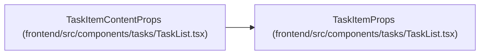

# TaskItemProps

**Location:** `frontend/src/components/tasks/TaskList.tsx:730`
**Kind:** Class
**Bases:** —
**Module:** [TaskList](../modules/TaskList.md)

## Description

_Auto-generated from `TaskItemProps` in `frontend/src/components/tasks/TaskList.tsx`._

## Attributes

| Name | Type | Required | Default | Description |
|------|------|----------|---------|-------------|
| `task` | `Task` | Yes | — | — |
| `onEdit` | `(t: Task) => void` | Yes | — | — |
| `onAddSubtask` | `(id: number) => void` | Yes | — | — |
| `onDelete` | `(task: Task) => void` | Yes | — | — |
| `onUnmerge` | `(taskId: number) => void` | Yes | — | — |
| `isUnmergePending` | `boolean` | Yes | — | — |
| `level` | `number` | Yes | — | — |
| `sensors` | `ReturnType<typeof useSensors>` | Yes | — | — |
| `onChildDragEnd` | `(parent: Task, event: DragEndEvent) => void` | Yes | — | — |
| `isDraggingEnabled` | `boolean` | Yes | — | — |
| `taskMap` | `Map<number, Task>` | Yes | — | — |
| `isMergeMode` | `boolean` | Yes | — | — |
| `selectedTaskIds` | `Set<number>` | Yes | — | — |
| `canSelectForMerge` | `(task: Task) => boolean` | Yes | — | — |
| `toggleTaskSelection` | `(taskId: number) => void` | Yes | — | — |
| `isBulkMode` | `boolean` | Yes | — | — |
| `selectedBulkTaskIds` | `Set<number>` | Yes | — | — |
| `toggleBulkTaskSelection` | `(taskId: number) => void` | Yes | — | — |
| `labelsBySlug` | `Map<string, Label>` | Yes | — | — |
| `nowMs` | `number` | Yes | — | — |

## Methods

*No public methods. Inherits from base classes.*

## Relationships

<!-- Auto-generated relationship summary. Do not edit by hand. -->

### Summary

| Module | Methods | Attributes |
|---|---:|---|
| [TaskList](../modules/TaskList.md) | 0 | `canSelectForMerge`, `isBulkMode`, `isDraggingEnabled`, `isMergeMode`, `isUnmergePending`, `labelsBySlug`, `level`, `nowMs`, `onAddSubtask`, `onChildDragEnd`, `onDelete`, `onEdit` |

### Structure

| Kind | Entity | Module |
|---|---|---|
| Subclass | `TaskItemContentProps` | [TaskList](../modules/TaskList.md) |
