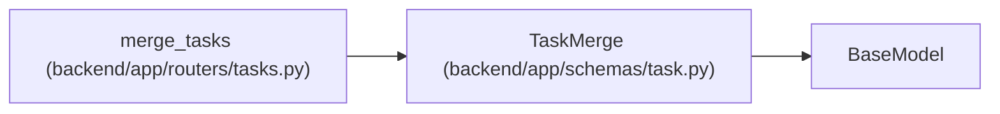

# TaskMerge

**Location:** `backend/app/schemas/task.py:219`
**Kind:** Pydantic model
**Bases:** `BaseModel`
**Module:** [schemas_task](../modules/schemas_task.md)

## Description

Request schema for merging tasks under a new parent.

## Attributes

| Name | Type | Wire name | Required | Nullable | Default | Constraints | Examples | Description |
|------|------|-----------|----------|----------|---------|-------------|-------------|----------|
| `task_ids` | `list[int]` | `task_ids` | Yes | No | — | min_length=2 | — | IDs of tasks to merge (min 2) |
| `parent_title` | `str` | `parent_title` | Yes | No | — | min_length=1; max_length=500 | — | — |
| `parent_description` | `Optional[str]` | `parent_description` | No | Yes | `None` | — | — | — |

## Methods

*No public methods. Inherits from base classes.*

## Relationships

<!-- Auto-generated relationship summary. Do not edit by hand. -->

### Summary

| Module | Methods | Attributes |
|---|---:|---|
| [schemas_task](../modules/schemas_task.md) | 0 | `parent_description`, `parent_title`, `task_ids` |

### Structure

| Kind | Entity | Module |
|---|---|---|
| Base | `BaseModel` | — |

### References

| Reference | Kind | Source | Call sites |
|---|---|---|---:|
| `merge_tasks` | type_reference | [tasks](../modules/tasks.md) | — |
