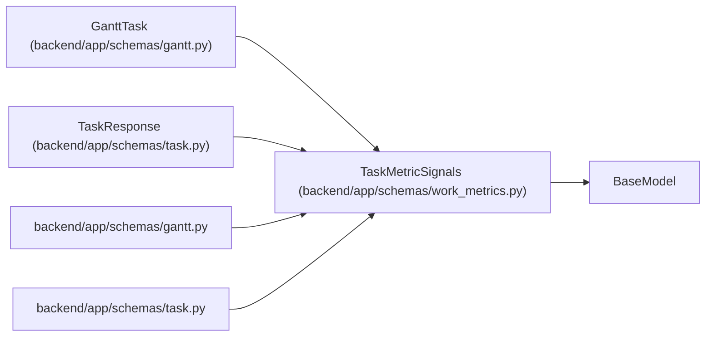

# TaskMetricSignals

**Location:** `backend/app/schemas/work_metrics.py:24`
**Kind:** Pydantic model
**Bases:** `BaseModel`
**Module:** [schemas_work_metrics](../modules/schemas_work_metrics.md)

## Description

_Auto-generated from `TaskMetricSignals` in `backend/app/schemas/work_metrics.py`._

## Attributes

| Name | Type | Wire name | Required | Nullable | Default | Constraints | Examples | Description |
|------|------|-----------|----------|----------|---------|-------------|-------------|----------|
| `effective_is_deferred` | `bool` | `effective_is_deferred` | No | No | `False` | — | — | — |
| `effective_is_optional` | `bool` | `effective_is_optional` | No | No | `False` | — | — | — |
| `metric_contract_version` | `int` | `metric_contract_version` | No | No | `2` | — | — | — |
| `is_late_start` | `bool` | `is_late_start` | No | No | `False` | — | — | — |
| `is_iteration_overflow` | `bool` | `is_iteration_overflow` | No | No | `False` | — | — | — |
| `is_project_target_overflow` | `bool` | `is_project_target_overflow` | No | No | `False` | — | — | — |
| `is_implemented` | `bool` | `is_implemented` | No | No | `False` | — | — | — |
| `is_accepted` | `bool` | `is_accepted` | No | No | `False` | — | — | — |
| `acceptance_unknown` | `bool` | `acceptance_unknown` | No | No | `False` | — | — | — |

## Methods

*No public methods. Inherits from base classes.*

## Relationships

<!-- Auto-generated relationship summary. Do not edit by hand. -->

### Summary

| Module | Methods | Attributes |
|---|---:|---|
| [schemas_work_metrics](../modules/schemas_work_metrics.md) | 0 | `acceptance_unknown`, `effective_is_deferred`, `effective_is_optional`, `is_accepted`, `is_implemented`, `is_iteration_overflow`, `is_late_start`, `is_project_target_overflow`, `metric_contract_version` |

### Structure

| Kind | Entity | Module |
|---|---|---|
| Base | `BaseModel` | — |
| Subclass | `GanttTask` | [schemas_gantt](../modules/schemas_gantt.md) |
| Subclass | `TaskResponse` | [schemas_task](../modules/schemas_task.md) |

### References

| Reference | Kind | Source | Call sites |
|---|---|---|---:|
| `gantt` | import | [schemas_gantt](../modules/schemas_gantt.md) | — |
| `task` | import | [schemas_task](../modules/schemas_task.md) | — |
