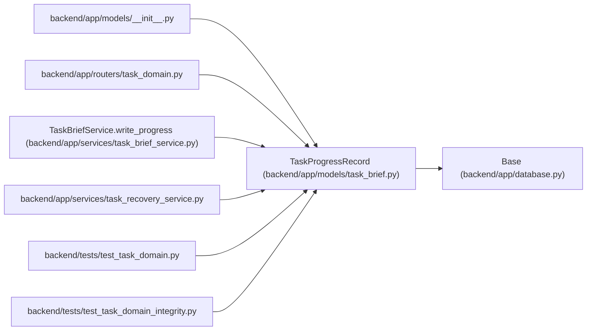

# TaskProgressRecord

**Location:** `backend/app/models/task_brief.py:30`
**Kind:** Class
**Bases:** `Base`
**Module:** [models_task_brief](../modules/models_task_brief.md)

## Description

_Auto-generated from `TaskProgressRecord` in `backend/app/models/task_brief.py`._

Immutable worker-reported criterion states, evidence and artifact links, bound to the brief and artifact revision. Reporting progress grants no acceptance authority.

## Attributes

| Name | Type | Default | Description |
|------|------|---------|-------------|
| `id` | `Mapped[int]` | `mapped_column(Integer, primary_key=True)` | — |
| `task_id` | `Mapped[int \| None]` | `mapped_column(ForeignKey('tasks.id', ondelete='SET NULL'), index=True)` | — |
| `original_task_id` | `Mapped[int]` | `mapped_column(Integer, index=True)` | — |
| `task_version` | `Mapped[int]` | `mapped_column(Integer)` | — |
| `brief_revision` | `Mapped[int]` | `mapped_column(Integer)` | — |
| `artifact_revision` | `Mapped[int]` | `mapped_column(Integer)` | — |
| `principal_id` | `Mapped[int \| None]` | `mapped_column(ForeignKey('principals.id', ondelete='RESTRICT'))` | — |
| `payload` | `Mapped[dict]` | `mapped_column(JSON)` | — |
| `created_at` | `Mapped[datetime]` | `mapped_column(UTCDateTime(), default=utc_now)` | — |

## Methods

*No public methods. Inherits from base classes.*

## Relationships

<!-- Auto-generated relationship summary. Do not edit by hand. -->

### Summary

| Module | Methods | Attributes |
|---|---:|---|
| [models_task_brief](../modules/models_task_brief.md) | 0 | `artifact_revision`, `brief_revision`, `created_at`, `id`, `original_task_id`, `payload`, `principal_id`, `task_id`, `task_version` |

### Structure

| Kind | Entity | Module |
|---|---|---|
| Base | `Base` | [app_database](../modules/app_database.md) |

### References

| Reference | Kind | Source | Call sites |
|---|---|---|---:|
| `__init__` | import | [models___init__](../modules/models___init__.md) | — |
| `task_domain` | import | [routers_task_domain](../modules/routers_task_domain.md) | — |
| `TaskBriefService.write_progress` | call | [task_brief_service](../modules/task_brief_service.md) | 1 |
| `task_recovery_service` | import | [task_recovery_service](../modules/task_recovery_service.md) | — |
| `test_task_domain` | import | [test_task_domain](../modules/test_task_domain.md) | — |
| `test_task_domain_integrity` | import | [test_task_domain_integrity](../modules/test_task_domain_integrity.md) | — |
