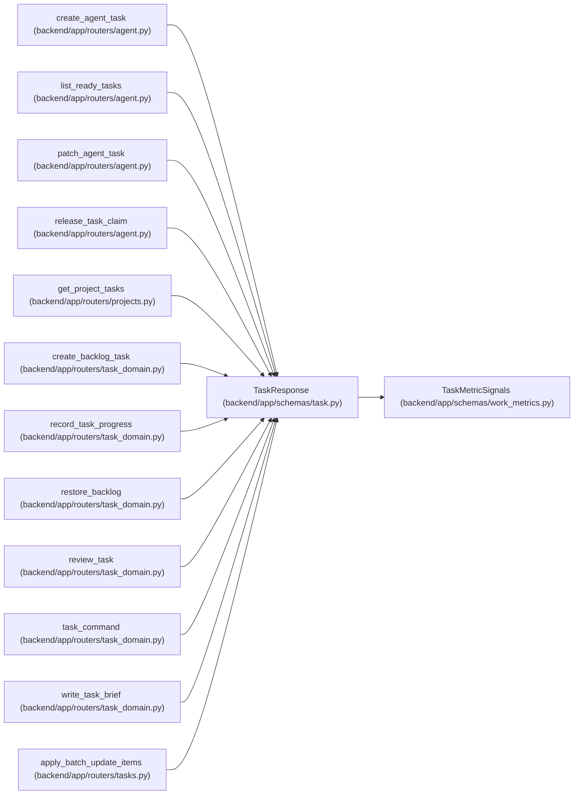

# TaskResponse

**Location:** `backend/app/schemas/task.py:186`
**Kind:** Pydantic model
**Bases:** `TaskMetricSignals`
**Module:** [schemas_task](../modules/schemas_task.md)

## Description

Schema for task response.

## Model Configuration

| Setting | Value | Source |
|---------|-------|--------|
| `from_attributes` | `True` | config_class |

## Attributes

| Name | Type | Wire name | Required | Nullable | Default | Constraints | Examples | Description |
|------|------|-----------|----------|----------|---------|-------------|-------------|----------|
| `iteration_revision` | `Optional[int]` | `iteration_revision` | No | Yes | `None` | — | — | — |
| `baseline_start_date` | `Optional[date]` | `baseline_start_date` | No | Yes | `None` | — | — | — |
| `baseline_end_date` | `Optional[date]` | `baseline_end_date` | No | Yes | `None` | — | — | — |
| `baseline_revision` | `int` | `baseline_revision` | No | No | `0` | — | — | — |
| `baseline_provenance` | `str` | `baseline_provenance` | No | No | `'legacy_unknown'` | — | — | — |
| `started_at` | `Optional[datetime]` | `started_at` | No | Yes | `None` | — | — | — |
| `resolved_at` | `Optional[datetime]` | `resolved_at` | No | Yes | `None` | — | — | — |
| `accepted_at` | `Optional[datetime]` | `accepted_at` | No | Yes | `None` | — | — | — |
| `id` | `int` | `id` | Yes | No | — | — | — | — |
| `iteration_id` | `Optional[int]` | `iteration_id` | Yes | Yes | — | — | — | — |
| `project_id` | `Optional[int]` | `project_id` | No | Yes | `None` | — | — | — |
| `milestone_id` | `Optional[int]` | `milestone_id` | No | Yes | `None` | — | — | — |
| `parent_id` | `Optional[int]` | `parent_id` | Yes | Yes | — | — | — | — |
| `title` | `str` | `title` | Yes | No | — | — | — | — |
| `description` | `Optional[str]` | `description` | Yes | Yes | — | — | — | — |
| `priority` | `int` | `priority` | Yes | No | — | — | — | — |
| `effort_days` | `Optional[float]` | `effort_days` | Yes | Yes | — | — | — | — |
| `effort_hours` | `Optional[float]` | `effort_hours` | Yes | Yes | — | — | — | — |
| `nominal_day_hours` | `float` | `nominal_day_hours` | No | No | `8` | — | — | — |
| `estimate_provenance` | `str` | `estimate_provenance` | No | No | `'unknown'` | — | — | — |
| `owner_profile_id` | `Optional[int]` | `owner_profile_id` | No | Yes | `None` | — | — | — |
| `owner` | `Optional[TaskAssignee]` | `owner` | No | Yes | `None` | — | — | — |
| `ownership_provenance` | `str` | `ownership_provenance` | No | No | `'unassigned'` | — | — | — |
| `blocked_reason` | `Optional[str]` | `blocked_reason` | No | Yes | `None` | — | — | — |
| `canceled_at` | `Optional[datetime]` | `canceled_at` | No | Yes | `None` | — | — | — |
| `canceled_reason` | `Optional[str]` | `canceled_reason` | No | Yes | `None` | — | — | — |
| `execution_mode` | `str` | `execution_mode` | No | No | `'scheduled'` | — | — | — |
| `brief` | `Optional[TaskBrief]` | `brief` | No | Yes | `None` | — | — | — |
| `brief_revision` | `int` | `brief_revision` | No | No | `0` | — | — | — |
| `brief_provenance` | `str` | `brief_provenance` | No | No | `'legacy_text'` | — | — | — |
| `legacy_description` | `Optional[str]` | `legacy_description` | No | Yes | `None` | — | — | — |
| `brief_migration_notes` | `list[str]` | `brief_migration_notes` | No | No | factory: `list` | — | — | — |
| `artifact_revision` | `int` | `artifact_revision` | No | No | `0` | — | — | — |
| `progress` | `Optional[dict[str, Any]]` | `progress` | No | Yes | `None` | — | — | — |
| `project` | `Optional[TaskProject]` | `project` | No | Yes | `None` | — | — | — |
| `milestone` | `Optional[TaskMilestone]` | `milestone` | No | Yes | `None` | — | — | — |
| `assignee` | `Optional[TaskAssignee]` | `assignee` | No | Yes | `None` | — | — | — |
| `status` | `str` | `status` | Yes | No | — | — | — | — |
| `start_date` | `Optional[date]` | `start_date` | Yes | Yes | — | — | — | — |
| `end_date` | `Optional[date]` | `end_date` | Yes | Yes | — | — | — | — |
| `actual_start_date` | `Optional[date]` | `actual_start_date` | No | Yes | `None` | — | — | — |
| `actual_end_date` | `Optional[date]` | `actual_end_date` | No | Yes | `None` | — | — | — |
| `min_start_date` | `Optional[date]` | `min_start_date` | No | Yes | `None` | — | — | — |
| `max_end_date` | `Optional[date]` | `max_end_date` | No | Yes | `None` | — | — | — |
| `is_overdue` | `bool` | `is_overdue` | No | No | `False` | — | — | — |
| `is_delayed` | `bool` | `is_delayed` | No | No | `False` | — | — | — |
| `is_composite` | `bool` | `is_composite` | No | No | `False` | — | — | — |
| `is_optional` | `bool` | `is_optional` | No | No | `False` | — | — | — |
| `is_deferred` | `bool` | `is_deferred` | No | No | `False` | — | — | — |
| `is_outside_constraints` | `bool` | `is_outside_constraints` | No | No | `False` | — | — | — |
| `tags` | `list[str]` | `tags` | No | No | `[]` | — | — | — |
| `sort_order` | `int` | `sort_order` | No | No | `0` | — | — | — |
| `external_key` | `Optional[str]` | `external_key` | No | Yes | `None` | — | — | — |
| `source` | `Optional[str]` | `source` | No | Yes | `None` | — | — | — |
| `source_url` | `Optional[str]` | `source_url` | No | Yes | `None` | — | — | — |
| `external_links` | `list[ExternalLinkResponse]` | `external_links` | No | No | factory: `list` | — | — | — |
| `request_count` | `int` | `request_count` | No | No | `0` | — | — | — |
| `agent_readiness` | `TaskAgentReadiness` | `agent_readiness` | No | No | factory: `TaskAgentReadiness` | — | — | — |
| `version` | `int` | `version` | No | No | `1` | — | — | — |
| `claimed_by` | `Optional[TaskClaimedBy]` | `claimed_by` | No | Yes | `None` | — | — | — |
| `claim_expires_at` | `Optional[datetime]` | `claim_expires_at` | No | Yes | `None` | — | — | — |
| `updated_at` | `Optional[datetime]` | `updated_at` | No | Yes | `None` | — | — | — |
| `children` | `list['TaskResponse']` | `children` | No | No | `[]` | — | — | — |
| `dependencies` | `list[int]` | `dependencies` | No | No | `[]` | — | — | — |

## Methods

*No public methods. Inherits from base classes.*

## Relationships

<!-- Auto-generated relationship summary. Do not edit by hand. -->

### Summary

| Module | Methods | Attributes |
|---|---:|---|
| [schemas_task](../modules/schemas_task.md) | 0 | `accepted_at`, `actual_end_date`, `actual_start_date`, `agent_readiness`, `artifact_revision`, `assignee`, `baseline_end_date`, `baseline_provenance`, `baseline_revision`, `baseline_start_date`, `blocked_reason`, `brief` |

### Structure

| Kind | Entity | Module |
|---|---|---|
| Base | `TaskMetricSignals` | [schemas_work_metrics](../modules/schemas_work_metrics.md) |

### References

| Reference | Kind | Source | Call sites |
|---|---|---|---:|
| `create_agent_task` | type_reference | [routers_agent](../modules/routers_agent.md) | — |
| `list_ready_tasks` | type_reference | [routers_agent](../modules/routers_agent.md) | — |
| `patch_agent_task` | type_reference | [routers_agent](../modules/routers_agent.md) | — |
| `release_task_claim` | type_reference | [routers_agent](../modules/routers_agent.md) | — |
| `get_project_tasks` | type_reference | [projects](../modules/projects.md) | — |
| `create_backlog_task` | type_reference | [routers_task_domain](../modules/routers_task_domain.md) | — |
| `record_task_progress` | type_reference | [routers_task_domain](../modules/routers_task_domain.md) | — |
| `restore_backlog` | type_reference | [routers_task_domain](../modules/routers_task_domain.md) | — |
| `review_task` | type_reference | [routers_task_domain](../modules/routers_task_domain.md) | — |
| `task_command` | type_reference | [routers_task_domain](../modules/routers_task_domain.md) | — |
| `write_task_brief` | type_reference | [routers_task_domain](../modules/routers_task_domain.md) | — |
| `apply_batch_update_items` | type_reference | [tasks](../modules/tasks.md) | — |

> References: showing 12 of 35 logical references; 23 omitted by the 12-row generated summary limit.
