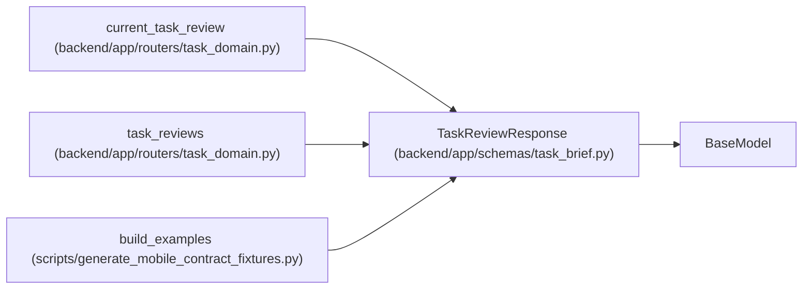

# TaskReviewResponse

**Location:** `backend/app/schemas/task_brief.py:90`
**Kind:** Pydantic model
**Bases:** `BaseModel`
**Module:** [schemas_task_brief](../modules/schemas_task_brief.md)

## Description

_Auto-generated from `TaskReviewResponse` in `backend/app/schemas/task_brief.py`._

## Model Configuration

| Setting | Value | Source |
|---------|-------|--------|
| `from_attributes` | `True` | model_config |

## Attributes

| Name | Type | Wire name | Required | Nullable | Default | Constraints | Examples | Description |
|------|------|-----------|----------|----------|---------|-------------|-------------|----------|
| `id` | `int` | `id` | Yes | No | — | — | — | — |
| `task_version` | `int` | `task_version` | Yes | No | — | — | — | — |
| `brief_revision` | `int` | `brief_revision` | Yes | No | — | — | — | — |
| `artifact_revision` | `int` | `artifact_revision` | Yes | No | — | — | — | — |
| `principal_id` | `int \| None` | `principal_id` | Yes | Yes | — | — | — | — |
| `verdict` | `str` | `verdict` | Yes | No | — | — | — | — |
| `reason` | `str` | `reason` | Yes | No | — | — | — | — |
| `evidence` | `str` | `evidence` | Yes | No | — | — | — | — |
| `created_at` | `datetime` | `created_at` | Yes | No | — | — | — | — |

## Methods

*No public methods. Inherits from base classes.*

## Relationships

<!-- Auto-generated relationship summary. Do not edit by hand. -->

### Summary

| Module | Methods | Attributes |
|---|---:|---|
| [schemas_task_brief](../modules/schemas_task_brief.md) | 0 | `artifact_revision`, `brief_revision`, `created_at`, `evidence`, `id`, `principal_id`, `reason`, `task_version`, `verdict` |

### Structure

| Kind | Entity | Module |
|---|---|---|
| Base | `BaseModel` | — |

### References

| Reference | Kind | Source | Call sites |
|---|---|---|---:|
| `current_task_review` | type_reference | [routers_task_domain](../modules/routers_task_domain.md) | — |
| `task_reviews` | type_reference | [routers_task_domain](../modules/routers_task_domain.md) | — |
| `build_examples` | call | [generate_mobile_contract_fixtures](../modules/generate_mobile_contract_fixtures.md) | 1 |
