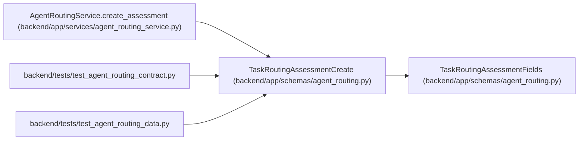

# TaskRoutingAssessmentCreate

**Location:** `backend/app/schemas/agent_routing.py:606`
**Kind:** Pydantic model
**Bases:** `TaskRoutingAssessmentFields`
**Module:** [agent_routing](../modules/agent_routing.md)

## Description

Create payload for one append-only assessment.

## Attributes

*No annotated attributes found.*

## Methods

*No public methods. Inherits from base classes.*

## Relationships

<!-- Auto-generated relationship summary. Do not edit by hand. -->

### Summary

| Module | Methods | Attributes |
|---|---:|---|
| [agent_routing](../modules/agent_routing.md) | 0 | — |

### Structure

| Kind | Entity | Module |
|---|---|---|
| Base | `TaskRoutingAssessmentFields` | [agent_routing](../modules/agent_routing.md) |

### References

| Reference | Kind | Source | Call sites |
|---|---|---|---:|
| `AgentRoutingService.create_assessment` | call | [agent_routing_service](../modules/agent_routing_service.md) | 1 |
| `test_agent_routing_contract` | import | [test_agent_routing_contract](../modules/test_agent_routing_contract.md) | — |
| `test_agent_routing_data` | import | [test_agent_routing_data](../modules/test_agent_routing_data.md) | — |
