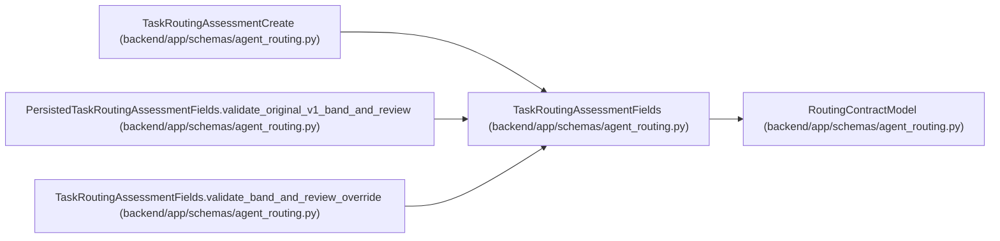

# TaskRoutingAssessmentFields

**Location:** `backend/app/schemas/agent_routing.py:547`
**Kind:** Pydantic model
**Bases:** `RoutingContractModel`
**Module:** [agent_routing](../modules/agent_routing.md)

## Description

Immutable assessment bound to one concrete task version.

## Validators

| Method | Scope | Fields | Mode | Options |
|--------|-------|--------|------|---------|
| `validate_required_skills` | field | required_skill_levels | before | — |
| `validate_reason_codes` | field | reason_codes | before | — |
| `strip_assessment_text` | field | rationale, assessor | after | — |
| `reject_nonfinite_confidence` | field | confidence | after | — |
| `validate_band_and_review_override` | model | — | after | — |

## Attributes

| Name | Type | Wire name | Required | Nullable | Default | Constraints | Examples | Description |
|------|------|-----------|----------|----------|---------|-------------|-------------|----------|
| `task_id` | `int` | `task_id` | Yes | No | — | ge=1 | — | — |
| `task_version` | `int` | `task_version` | Yes | No | — | ge=1 | — | — |
| `policy_version` | `Literal['model-aware-routing-v1']` | `policy_version` | No | No | `ROUTING_POLICY_VERSION` | — | — | — |
| `band` | `TaskDifficultyBand` | `band` | Yes | No | — | — | — | — |
| `axes` | `TaskDifficultyAxes` | `axes` | Yes | No | — | — | — | — |
| `required_skill_levels` | `dict[str, SkillLevel]` | `required_skill_levels` | No | No | factory: `dict` | — | — | — |
| `required_model` | `RequiredModelEnvelope` | `required_model` | Yes | No | — | — | — | — |
| `review_mode` | `TaskReviewMode` | `review_mode` | Yes | No | — | — | — | — |
| `confidence` | `float` | `confidence` | Yes | No | — | ge=0.0; le=1.0 | — | — |
| `reason_codes` | `list[AssessmentReasonCode]` | `reason_codes` | No | No | factory: `list` | — | — | — |
| `rationale` | `str` | `rationale` | Yes | No | — | min_length=1; max_length=unknown (MAX_ROUTING_TEXT_LENGTH) | — | — |
| `assessor` | `str` | `assessor` | Yes | No | — | min_length=1; max_length=255 | — | — |
| `assessor_actor_id` | `int \| None` | `assessor_actor_id` | No | Yes | `None` | ge=1 | — | — |

## Methods

| Method | Signature | Decorators | Description |
|--------|-----------|------------|-------------|
| `validate_required_skills` | `(value: Any) -> Any` | `@field_validator('required_skill_levels', mode='before')`, `@classmethod` | — |
| `validate_reason_codes` | `(value: Any) -> Any` | `@field_validator('reason_codes', mode='before')`, `@classmethod` | — |
| `strip_assessment_text` | `(value: str) -> str` | `@field_validator('rationale', 'assessor')`, `@classmethod` | — |
| `reject_nonfinite_confidence` | `(value: float) -> float` | `@field_validator('confidence')`, `@classmethod` | — |
| `validate_band_and_review_override` | `() -> 'TaskRoutingAssessmentFields'` | `@model_validator(mode='after')` | — |
| `model_values` | `() -> dict[str, Any]` | — | Return deterministic ORM constructor values without hiding axes. |

## Relationships

<!-- Auto-generated relationship summary. Do not edit by hand. -->

### Summary

| Module | Methods | Attributes |
|---|---:|---|
| [agent_routing](../modules/agent_routing.md) | 6 | `assessor`, `assessor_actor_id`, `axes`, `band`, `confidence`, `policy_version`, `rationale`, `reason_codes`, `required_model`, `required_skill_levels`, `review_mode`, `task_id` |

### Structure

| Kind | Entity | Module |
|---|---|---|
| Base | `RoutingContractModel` | [agent_routing](../modules/agent_routing.md) |
| Subclass | `TaskRoutingAssessmentCreate` | [agent_routing](../modules/agent_routing.md) |

### References

| Reference | Kind | Source | Call sites |
|---|---|---|---:|
| `PersistedTaskRoutingAssessmentFields.validate_original_v1_band_and_review` | type_reference | [agent_routing](../modules/agent_routing.md) | — |
| `TaskRoutingAssessmentFields.validate_band_and_review_override` | type_reference | [agent_routing](../modules/agent_routing.md) | — |
