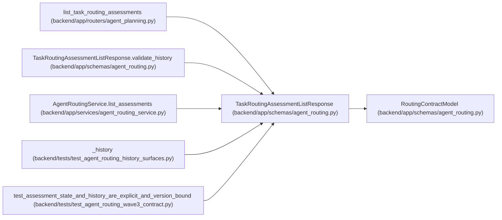

# TaskRoutingAssessmentListResponse

**Location:** `backend/app/schemas/agent_routing.py:833`
**Kind:** Pydantic model
**Bases:** `RoutingContractModel`
**Module:** [agent_routing](../modules/agent_routing.md)

## Description

Bounded newest-first assessment history for one task.

## Validators

| Method | Scope | Fields | Mode | Options |
|--------|-------|--------|------|---------|
| `validate_history` | model | — | after | — |

## Attributes

| Name | Type | Wire name | Required | Nullable | Default | Constraints | Examples | Description |
|------|------|-----------|----------|----------|---------|-------------|-------------|----------|
| `task_id` | `int` | `task_id` | Yes | No | — | strict=True; ge=1 | — | — |
| `current_task_version` | `int` | `current_task_version` | Yes | No | — | strict=True; ge=1 | — | — |
| `assessments` | `list[TaskRoutingAssessmentResponse]` | `assessments` | No | No | factory: `list` | max_length=unknown (MAX_ROUTING_ASSESSMENT_HISTORY) | — | — |
| `total_count` | `int` | `total_count` | Yes | No | — | strict=True; ge=0 | — | — |
| `omitted_count` | `int` | `omitted_count` | No | No | `0` | strict=True; ge=0 | — | — |

## Methods

| Method | Signature | Decorators | Description |
|--------|-----------|------------|-------------|
| `validate_history` | `() -> 'TaskRoutingAssessmentListResponse'` | `@model_validator(mode='after')` | — |

## Relationships

<!-- Auto-generated relationship summary. Do not edit by hand. -->

### Summary

| Module | Methods | Attributes |
|---|---:|---|
| [agent_routing](../modules/agent_routing.md) | 1 | `assessments`, `current_task_version`, `omitted_count`, `task_id`, `total_count` |

### Structure

| Kind | Entity | Module |
|---|---|---|
| Base | `RoutingContractModel` | [agent_routing](../modules/agent_routing.md) |

### References

| Reference | Kind | Source | Call sites |
|---|---|---|---:|
| `list_task_routing_assessments` | type_reference | [routers_agent_planning](../modules/routers_agent_planning.md) | — |
| `TaskRoutingAssessmentListResponse.validate_history` | type_reference | [agent_routing](../modules/agent_routing.md) | — |
| `AgentRoutingService.list_assessments` | call | [agent_routing_service](../modules/agent_routing_service.md) | 1 |
| `AgentRoutingService.list_assessments` | type_reference | [agent_routing_service](../modules/agent_routing_service.md) | — |
| `_history` | call | [test_agent_routing_history_surfaces](../modules/test_agent_routing_history_surfaces.md) | 1 |
| `_history` | type_reference | [test_agent_routing_history_surfaces](../modules/test_agent_routing_history_surfaces.md) | — |
| `test_assessment_state_and_history_are_explicit_and_version_bound` | call | [test_agent_routing_wave3_contract](../modules/test_agent_routing_wave3_contract.md) | 1 |
