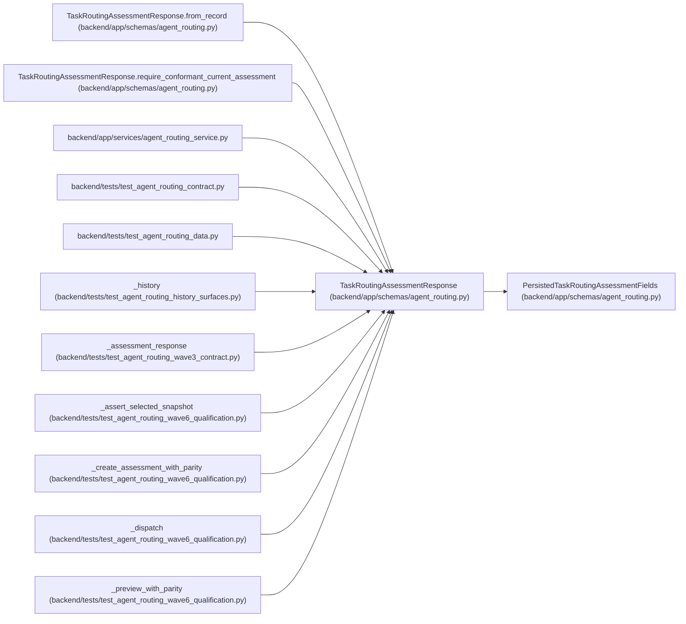

# TaskRoutingAssessmentResponse

**Location:** `backend/app/schemas/agent_routing.py:753`
**Kind:** Pydantic model
**Bases:** `PersistedTaskRoutingAssessmentFields`
**Module:** [agent_routing](../modules/agent_routing.md)

## Description

Audit-readable assessment projection with fail-closed routeability.

## Validators

| Method | Scope | Fields | Mode | Options |
|--------|-------|--------|------|---------|
| `require_conformant_current_assessment` | model | — | after | — |

## Attributes

| Name | Type | Wire name | Required | Nullable | Default | Constraints | Examples | Description |
|------|------|-----------|----------|----------|---------|-------------|-------------|----------|
| `id` | `int` | `id` | Yes | No | — | — | — | — |
| `created_at` | `datetime` | `created_at` | Yes | No | — | — | — | — |
| `policy_conformant` | `bool` | `policy_conformant` | No | No | `False` | — | — | — |
| `is_current` | `bool` | `is_current` | Yes | No | — | — | — | — |

## Methods

| Method | Signature | Decorators | Description |
|--------|-----------|------------|-------------|
| `require_conformant_current_assessment` | `() -> 'TaskRoutingAssessmentResponse'` | `@model_validator(mode='after')` | — |
| `from_record` | `(record: Any, *, current_task_version: int) -> 'TaskRoutingAssessmentResponse'` | `@classmethod` | — |

## Relationships

<!-- Auto-generated relationship summary. Do not edit by hand. -->

### Summary

| Module | Methods | Attributes |
|---|---:|---|
| [agent_routing](../modules/agent_routing.md) | 2 | `created_at`, `id`, `is_current`, `policy_conformant` |

### Structure

| Kind | Entity | Module |
|---|---|---|
| Base | `PersistedTaskRoutingAssessmentFields` | [agent_routing](../modules/agent_routing.md) |

### References

| Reference | Kind | Source | Call sites |
|---|---|---|---:|
| `TaskRoutingAssessmentResponse.from_record` | type_reference | [agent_routing](../modules/agent_routing.md) | — |
| `TaskRoutingAssessmentResponse.require_conformant_current_assessment` | type_reference | [agent_routing](../modules/agent_routing.md) | — |
| `agent_routing_service` | import | [agent_routing_service](../modules/agent_routing_service.md) | — |
| `test_agent_routing_contract` | import | [test_agent_routing_contract](../modules/test_agent_routing_contract.md) | — |
| `test_agent_routing_data` | import | [test_agent_routing_data](../modules/test_agent_routing_data.md) | — |
| `_history` | call | [test_agent_routing_history_surfaces](../modules/test_agent_routing_history_surfaces.md) | 1 |
| `_assessment_response` | call | [test_agent_routing_wave3_contract](../modules/test_agent_routing_wave3_contract.md) | 1 |
| `_assessment_response` | type_reference | [test_agent_routing_wave3_contract](../modules/test_agent_routing_wave3_contract.md) | — |
| `_assert_selected_snapshot` | type_reference | [test_agent_routing_wave6_qualification](../modules/test_agent_routing_wave6_qualification.md) | — |
| `_create_assessment_with_parity` | type_reference | [test_agent_routing_wave6_qualification](../modules/test_agent_routing_wave6_qualification.md) | — |
| `_dispatch` | type_reference | [test_agent_routing_wave6_qualification](../modules/test_agent_routing_wave6_qualification.md) | — |
| `_preview_with_parity` | type_reference | [test_agent_routing_wave6_qualification](../modules/test_agent_routing_wave6_qualification.md) | — |
