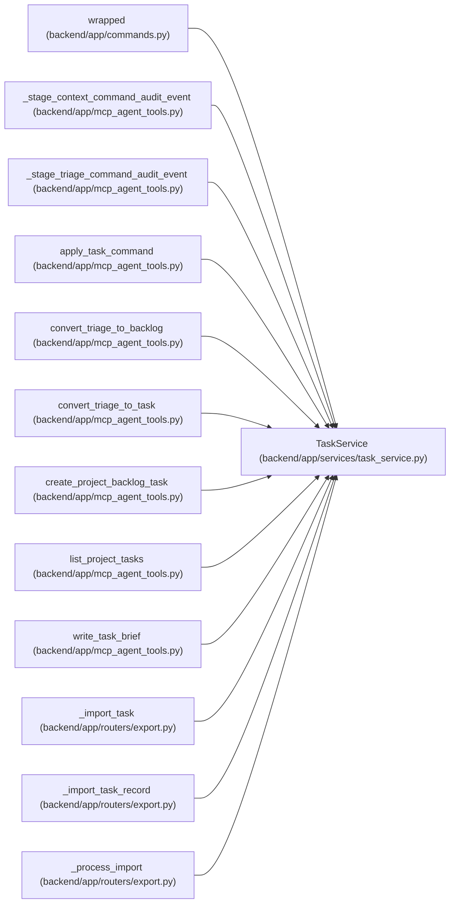

# TaskService

**Location:** `backend/app/services/task_service.py:71`
**Kind:** Class
**Bases:** —
**Module:** [task_service](../modules/task_service.md)

## Description

Service for task operations.

Task and aggregate versions fence edits and structural commands. Merge/unmerge reconcile old/new ancestors with leaf-only effort and lower-number-is-higher priority; claimed descendants require recovery. Pure rearrangement preserves valid accepted leaf evidence and effective optional/deferred meaning with audit, while content changes invalidate old acceptance. An empty summary remains structural rather than becoming invented leaf work.

Backlog project changes require edit permission in both scopes. Project locks are acquired in ascending ID order and the task scope is rechecked before writing. The complete subtree must have no incoming or outgoing dependency across its boundary. Both backlogs receive transactional recovery points, descendants reserve one version per command, and rejected moves roll everything back. Actual dependency changes invalidate current progress and acceptance through general updates and individual add/remove commands. Immutable evidence history remains available, a command reserves one task version, and no-op dependency requests retain their current version. Locked graph relationships are loaded explicitly before applying a dependency update.

## Attributes

*No annotated attributes found.*

## Methods

| Method | Signature | Decorators | Description |
|--------|-----------|------------|-------------|
| `__init__` | `(db: AsyncSession)` | — | — |
| `_json_dumps` | `(data: Any) -> str` | — | Serialize event payloads consistently. |
| `_project_exists` | *(async)* `(project_id: int) -> bool` | — | Return whether a project exists. |
| `_require_project_exists` | *(async)* `(project_id: Optional[int]) -> None` | — | Validate optional project reference. |
| `require_iteration_exists` | *(async)* `(iteration_id: int) -> None` | — | Validate that a task write target is a real iteration. |
| `_iteration_project_id` | *(async)* `(iteration_id: int) -> Optional[int]` | — | Return an iteration's project scope, raising when the iteration is missing. |
| `_resolve_project_for_iteration_create` | *(async)* `(iteration_id: int, requested_project_id: Optional[int]) -> Optional[int]` | — | Apply iteration project scope to a new executable task. |
| `require_task_project_scope_for_update` | *(async)* `(task: Task, requested_project_id: Optional[int], project_id_was_set: bool) -> Optional[int]` | — | Validate and return the effective project for a task update. |
| `_require_same_iteration_dependencies` | *(async)* `(iteration_id: int, dependency_ids: Sequence[int], project_id: int \| None = None) -> None` | — | Validate that task dependencies stay inside one iteration schedule graph. |
| `_require_acyclic_dependencies` | *(async)* `(task_id: int, iteration_id: int, dependency_ids: Sequence[int]) -> None` | — | Serialize one iteration graph and reject dependency cycles. |
| `_lock_dependency_task` | *(async)* `(task_id: int) -> Optional[Task]` | — | Lock one dependency graph in Iteration -> Task order. |
| `_milestone_project_id` | *(async)* `(milestone_id: int) -> Optional[int]` | — | Return the project owning a milestone, or None when missing. |
| `_require_milestone_compatible` | *(async)* `(milestone_id: Optional[int], project_id: Optional[int]) -> None` | — | Validate that a milestone belongs to the task's effective project. |
| `require_iteration_assignee` | *(async)* `(assignee_id: Optional[int], iteration_id: int) -> None` | — | Validate that an executable task assignee belongs to the task iteration. |
| `_milestone_matches_project` | *(async)* `(milestone_id: Optional[int], project_id: Optional[int]) -> bool` | — | Return whether an existing milestone assignment remains compatible. |
| `_cascade_project_to_children` | *(async)* `(parent_id: int, project_id: Optional[int], actor_type: str = 'user', actor_id: Optional[int] = None) -> list[int]` | — | Cascade a project assignment to all descendants. |
| `record_task_event` | *(async)* `(task_id: Optional[int], event_type: str, payload: Optional[dict] = None, actor_type: str = 'user', actor_id: Optional[int] = None, trace_id: Optional[str] = None, span_id: Optional[str] = None, correlation_id: Optional[str] = None, idempotency_key: Optional[str] = None) -> TaskEvent` | — | Append an audit event for a task mutation or checkpoint. |
| `_metadata_from_task` | `(task: Task) -> dict[str, Any]` | — | Return the client-safe current-task fields used by conflict responses. |
| `_current_task_metadata` | *(async)* `(task_id: int) -> dict[str, Any] \| None` | — | Load conflict metadata without loading the complete task tree. |
| `ensure_expected_version` | `(task: Task, expected_version: int \| None) -> None` | — | Fail early for an already-stale caller before filesystem side effects. |
| `reserve_task_version` | *(async)* `(task: Task, expected_version: int \| None) -> int` | — | Atomically reserve the next task version at the database write boundary. |
| `get_by_iteration` | *(async)* `(iteration_id: int, include_children: bool = True, *, max_tasks: int = MAX_ITERATION_TREE_TASKS) -> Sequence[Task]` | — | Get one explicitly bounded iteration tree from a flat task query. |
| `load_owner_names` | *(async)* `(tasks)` | — | Expose only the public owner name through already authorized task scope. |
| `_task_graph_query` | `(iteration_id: int \| None, project_id: int \| None = None)` | — | Build the bounded relationship query used before in-memory tree assembly. |
| `_load_iteration_tree` | *(async)* `(iteration_id: int, *, max_tasks: int = MAX_ITERATION_TREE_TASKS, project_id: int \| None = None) -> tuple[list[Task], dict[int, Task]]` | — | Load and defensively assemble a contract-bounded iteration. |
| `get_all_tasks` | *(async)* `(iteration_id: int) -> Sequence[Task]` | — | Get all tasks (flat list) for an iteration. |
| `get_by_id` | *(async)* `(task_id: int) -> Optional[Task]` | — | Get one task with its complete iteration tree relationships assembled. |
| `create` | *(async)* `(iteration_id: int, data: TaskCreate, actor_type: str = 'user', actor_id: Optional[int] = None, trace_id: Optional[str] = None, span_id: Optional[str] = None, correlation_id: Optional[str] = None, idempotency_key: Optional[str] = None, create_snapshot: bool = True, commit: bool = True) -> Task` | `@atomic_command` | Create a new task. |
| `create_subtask` | *(async)* `(parent_id: int, data: TaskCreate) -> Optional[Task]` | — | Create a subtask under a parent task. |
| `update` | *(async)* `(task_id: int, data: TaskUpdate, actor_type: str = 'user', actor_id: Optional[int] = None, trace_id: Optional[str] = None, span_id: Optional[str] = None, correlation_id: Optional[str] = None, idempotency_key: Optional[str] = None, commit: bool = True) -> Optional[Task]` | `@atomic_command` | Update an existing task. |
| `delete` | *(async)* `(task_id: int, actor_type: str = 'user', actor_id: Optional[int] = None, *, expected_version: Optional[int] = None, expected_revision: Optional[int] = None) -> bool` | `@atomic_command` | Delete a task and its subtasks. |
| `add_dependency` | *(async)* `(task_id: int, depends_on_id: int, actor_type: str = 'user', actor_id: Optional[int] = None) -> bool` | `@atomic_command` | Add a dependency to a task. |
| `remove_dependency` | *(async)* `(task_id: int, depends_on_id: int, actor_type: str = 'user', actor_id: Optional[int] = None) -> bool` | `@atomic_command` | Remove a dependency from a task. |
| `reorder_tasks` | *(async)* `(task_ids: list[int], iteration_id: Optional[int] = None, parent_id: Optional[int] = None, actor_type: str = 'user', actor_id: Optional[int] = None, expected_revision: int \| None = None) -> bool` | `@atomic_command` | Update sort_order for tasks within one declared sibling scope. |
| `_reserve_structural_version` | *(async)* `(task: Task, *, preserve_inherited_facets = False)` | — | Carry existing acceptance across a rearrangement that preserves leaf work meaning. |
| `merge_tasks` | *(async)* `(iteration_id: int, task_ids: list[int], parent_title: str, parent_description: Optional[str] = None, expected_revision: int \| None = None) -> Optional[Task]` | `@atomic_command` | Merge multiple leaf tasks under a new parent task. |
| `unmerge_task` | *(async)* `(parent_task_id: int, delete_parent: bool = True, *, expected_revisions = None) -> list[Task]` | `@atomic_command` | Promote children into the parent's sibling scope without losing referenced work. |
| `_lock_task_scope` | *(async)* `(task_id, *, target_iteration_id = None, target_project_id = None, expected_revisions = None)` | — | — |
| `_require_unclaimed_structure` | *(async)* `(task_ids)` | — | — |
| `_task_subtree_ids` | *(async)* `(root_task_id: int) -> set[int]` | — | Return the IDs in a task subtree, including the root. |
| `_require_no_cross_subtree_dependencies` | *(async)* `(subtree_ids: set[int]) -> None` | — | Reject moves that would leave dependency edges crossing work scopes. |
| `_resolve_project_for_move` | *(async)* `(task: Task, target_iteration_id: int, target_parent: Optional[Task]) -> Optional[int]` | — | Resolve the project assignment for a task subtree move. |
| `move_task` | *(async)* `(task_id: int, target_iteration_id: int, parent_id: Optional[int] = None, actor_type: str = 'user', actor_id: Optional[int] = None, expected_version: Optional[int] = None, expected_revisions: dict[int, int] \| None = None) -> Optional[Task]` | `@atomic_command` | Move a task subtree to an iteration, applying scoped project inheritance. |
| `task_to_response` | `(task: Task, iteration_end_date: Optional[date] = None) -> TaskResponse` | — | Convert Task model to TaskResponse schema. |
| `_get_next_root_sort_order` | *(async)* `(iteration_id: int) -> int` | — | Return the next root-level sort order for an iteration. |
| `_get_next_child_sort_order` | *(async)* `(parent_id: int) -> int` | — | Return the next child sort order under a parent task. |
| `import_service` | `()` | `@property` | Return the focused text import collaborator behind this facade. |
| `import_tasks` | *(async)* `(iteration_id: int, text: str, destination: TaskImportDestination = 'tasks') -> tuple[list[Task], list[TriageItem]]` | — | Delegate task and triage text imports to TaskImportService. |
| `get_tasks_as_text` | *(async)* `(iteration_id: int) -> str` | — | Delegate editable task text serialization to TaskImportService. |
| `bulk_update_tasks_from_text` | *(async)* `(iteration_id: int, text: str, destination: TaskImportDestination = 'tasks') -> tuple[list[Task], list[TriageItem]]` | — | Delegate bulk text edits to TaskImportService. |
| `status_service` | `()` | `@property` | Return the focused status collaborator behind this facade. |
| `change_status` | *(async)* `(task_id: int, new_status: TaskStatus \| str, reason: Optional[str] = None, actor_type: str = 'user', actor_id: Optional[int] = None, trace_id: Optional[str] = None, span_id: Optional[str] = None, correlation_id: Optional[str] = None, idempotency_key: Optional[str] = None, expected_version: Optional[int] = None, commit: bool = True, reserve_version: bool = True, manual_execution: bool = False, review_evidence: str = '', review_rework: bool = False) -> tuple[Optional[Task], list[dict], bool]` | `@atomic_command` | Delegate status transitions to TaskStatusService. |
| `_update_parent_status` | *(async)* `(parent_id: int) -> None` | — | Compatibility seam for parent reconciliation. |
| `_cascade_update_dependents` | *(async)* `(source_task: Task, original_end_date: date, reason: str) -> list[dict]` | — | Compatibility seam for dependent date cascade. |
| `get_status_history` | *(async)* `(task_id: int) -> list[Any]` | — | Delegate task status history reads. |
| `get_overdue_tasks` | *(async)* `(iteration_id: int) -> Sequence[Task]` | — | Delegate overdue task reads. |
| `get_iteration_status_history` | *(async)* `(iteration_id: int, limit: int = 50) -> list[Any]` | — | Delegate iteration status history reads. |
| `get_iteration_status_stats` | *(async)* `(iteration_id: int) -> list[dict]` | — | Delegate transition statistics. |

## Relationships

<!-- Auto-generated relationship summary. Do not edit by hand. -->

### Summary

| Module | Methods | Attributes |
|---|---:|---|
| [task_service](../modules/task_service.md) | 58 | — |

### References

| Reference | Kind | Source | Call sites |
|---|---|---|---:|
| `wrapped` | call | [commands](../modules/commands.md) | 1 |
| `_stage_context_command_audit_event` | call | [mcp_agent_tools](../modules/mcp_agent_tools.md) | 1 |
| `_stage_triage_command_audit_event` | call | [mcp_agent_tools](../modules/mcp_agent_tools.md) | 1 |
| `apply_task_command` | call | [mcp_agent_tools](../modules/mcp_agent_tools.md) | 1 |
| `convert_triage_to_backlog` | call | [mcp_agent_tools](../modules/mcp_agent_tools.md) | 1 |
| `convert_triage_to_task` | call | [mcp_agent_tools](../modules/mcp_agent_tools.md) | 1 |
| `create_project_backlog_task` | call | [mcp_agent_tools](../modules/mcp_agent_tools.md) | 2 |
| `list_project_tasks` | call | [mcp_agent_tools](../modules/mcp_agent_tools.md) | 1 |
| `write_task_brief` | call | [mcp_agent_tools](../modules/mcp_agent_tools.md) | 1 |
| `_import_task` | type_reference | [export](../modules/export.md) | — |
| `_import_task_record` | type_reference | [export](../modules/export.md) | — |
| `_process_import` | call | [export](../modules/export.md) | 1 |

> References: showing 12 of 123 logical references; 111 omitted by the 12-row generated summary limit.
