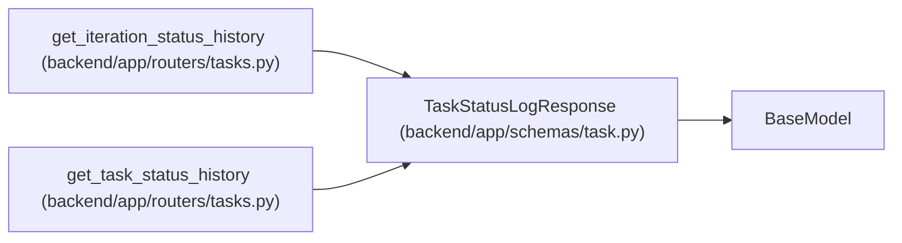

# TaskStatusLogResponse

**Location:** `backend/app/schemas/task.py:392`
**Kind:** Pydantic model
**Bases:** `BaseModel`
**Module:** [schemas_task](../modules/schemas_task.md)

## Description

Response for task status log entry.

## Attributes

| Name | Type | Wire name | Required | Nullable | Default | Constraints | Examples | Description |
|------|------|-----------|----------|----------|---------|-------------|-------------|----------|
| `id` | `int` | `id` | Yes | No | — | — | — | — |
| `task_id` | `int` | `task_id` | Yes | No | — | — | — | — |
| `task_title` | `Optional[str]` | `task_title` | No | Yes | `None` | — | — | — |
| `from_status` | `str` | `from_status` | Yes | No | — | — | — | — |
| `to_status` | `str` | `to_status` | Yes | No | — | — | — | — |
| `changed_at` | `datetime` | `changed_at` | Yes | No | — | — | — | — |
| `reason` | `Optional[str]` | `reason` | No | Yes | `None` | — | — | — |
| `triggered_by` | `str` | `triggered_by` | No | No | `'user'` | — | — | — |
| `affected_task_ids` | `list[int]` | `affected_task_ids` | No | No | `[]` | — | — | — |

## Methods

*No public methods. Inherits from base classes.*

## Relationships

<!-- Auto-generated relationship summary. Do not edit by hand. -->

### Summary

| Module | Methods | Attributes |
|---|---:|---|
| [schemas_task](../modules/schemas_task.md) | 0 | `affected_task_ids`, `changed_at`, `from_status`, `id`, `reason`, `task_id`, `task_title`, `to_status`, `triggered_by` |

### Structure

| Kind | Entity | Module |
|---|---|---|
| Base | `BaseModel` | — |

### References

| Reference | Kind | Source | Call sites |
|---|---|---|---:|
| `get_iteration_status_history` | call | [tasks](../modules/tasks.md) | 1 |
| `get_iteration_status_history` | type_reference | [tasks](../modules/tasks.md) | — |
| `get_task_status_history` | call | [tasks](../modules/tasks.md) | 1 |
| `get_task_status_history` | type_reference | [tasks](../modules/tasks.md) | — |
