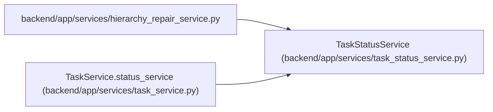

# TaskStatusService

**Location:** `backend/app/services/task_status_service.py:30`
**Kind:** Class
**Bases:** —
**Module:** [task_status_service](../modules/task_status_service.md)

## Description

Own status transitions, dependent cascades, and parent reconciliation.

Retains planned/active/resolved/closed transitions while separating actual UTC start/resolve/accept events from forecast dates and committed baselines. Acceptance requires review authority and is bound to the current task revision; automatic parent roll-up cannot fabricate independent leaf acceptance.

## Attributes

*No annotated attributes found.*

## Methods

| Method | Signature | Decorators | Description |
|--------|-----------|------------|-------------|
| `__init__` | `(db: AsyncSession, task_service: 'TaskService')` | — | — |
| `derive_parent_status` | `(child_statuses: Sequence[str]) -> str` | `@staticmethod` | Derive the complete parent roll-up truth table from child statuses. |
| `change_status` | *(async)* `(task_id: int, new_status: TaskStatus \| str, reason: Optional[str] = None, actor_type: str = 'user', actor_id: Optional[int] = None, trace_id: Optional[str] = None, span_id: Optional[str] = None, correlation_id: Optional[str] = None, idempotency_key: Optional[str] = None, expected_version: Optional[int] = None, commit: bool = True, reserve_version: bool = True, manual_execution: bool = False, review_evidence: str = '', review_rework: bool = False) -> tuple[Optional[Task], list[dict], bool]` | `@atomic_command` | Apply one valid direct transition and reconcile its ancestor chain. |
| `_apply_transition` | *(async)* `(task: Task, new_status: str, *, reason: Optional[str], actor_type: str, actor_id: Optional[int] = None, trace_id: Optional[str] = None, span_id: Optional[str] = None, correlation_id: Optional[str] = None, idempotency_key: Optional[str] = None, expected_version: Optional[int], automatic: bool, reserve_version: bool = True) -> tuple[Task, list[dict], bool]` | — | Run the shared mutation, audit, delivery, and notification semantics. |
| `reconcile_parent_chain` | *(async)* `(parent_id: int, *, visited: set[int] \| None = None, commit: bool = True) -> None` | — | Reconcile each ancestor at most once through the shared transition operation. |
| `cascade_update_dependents` | *(async)* `(source_task: Task, original_end_date: date, reason: str) -> list[dict]` | — | Shift planned dependent tasks when a predecessor is delayed. |
| `get_status_history` | *(async)* `(task_id: int) -> list[Any]` | — | Get status change history for a task. |
| `get_overdue_tasks` | *(async)* `(iteration_id: int) -> Sequence[Task]` | — | Return open leaf delivery past its expected completion in the working zone. |
| `get_iteration_status_history` | *(async)* `(iteration_id: int, limit: int = 50) -> list[Any]` | — | Get recent status history for one iteration. |
| `get_iteration_status_stats` | *(async)* `(iteration_id: int) -> list[dict]` | — | Aggregate transition counts for one iteration. |

## Relationships

<!-- Auto-generated relationship summary. Do not edit by hand. -->

### Summary

| Module | Methods | Attributes |
|---|---:|---|
| [task_status_service](../modules/task_status_service.md) | 10 | — |

### References

| Reference | Kind | Source | Call sites |
|---|---|---|---:|
| `hierarchy_repair_service` | import | [hierarchy_repair_service](../modules/hierarchy_repair_service.md) | — |
| `TaskService.status_service` | call | [task_service](../modules/task_service.md) | 1 |
