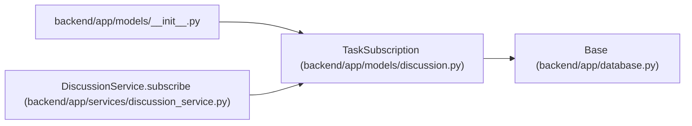

# TaskSubscription

**Location:** `backend/app/models/discussion.py:41`
**Kind:** Class
**Bases:** `Base`
**Module:** [models_discussion](../modules/models_discussion.md)

## Description

One person’s versioned notification choices for a task. Access to a task does not grant access to other people’s preferences, and dispatch rechecks the current setting.

## Attributes

| Name | Type | Default | Description |
|------|------|---------|-------------|
| `task_id` | `Mapped[int]` | `mapped_column(ForeignKey('tasks.id', ondelete='CASCADE'), primary_key=True)` | — |
| `principal_id` | `Mapped[int]` | `mapped_column(ForeignKey('principals.id', ondelete='CASCADE'), primary_key=True)` | — |
| `enabled` | `Mapped[bool]` | `mapped_column(nullable=False, default=True)` | — |
| `events` | `Mapped[list]` | `mapped_column(JSON, nullable=False, default=lambda: ['discussion', 'mention', 'review', 'block'])` | — |
| `version` | `Mapped[int]` | `mapped_column(Integer, nullable=False, default=1)` | — |

## Methods

*No public methods. Inherits from base classes.*

## Relationships

<!-- Auto-generated relationship summary. Do not edit by hand. -->

### Summary

| Module | Methods | Attributes |
|---|---:|---|
| [models_discussion](../modules/models_discussion.md) | 0 | `enabled`, `events`, `principal_id`, `task_id`, `version` |

### Structure

| Kind | Entity | Module |
|---|---|---|
| Base | `Base` | [app_database](../modules/app_database.md) |

### References

| Reference | Kind | Source | Call sites |
|---|---|---|---:|
| `__init__` | import | [models___init__](../modules/models___init__.md) | — |
| `DiscussionService.subscribe` | call | [discussion_service](../modules/discussion_service.md) | 1 |
