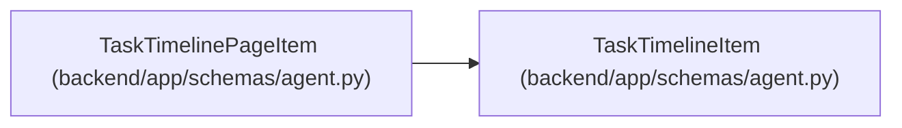

# TaskTimelinePageItem

**Location:** `backend/app/schemas/agent.py:462`
**Kind:** Pydantic model
**Bases:** `TaskTimelineItem`
**Module:** [schemas_agent](../modules/schemas_agent.md)

## Description

_Auto-generated from `TaskTimelinePageItem` in `backend/app/schemas/agent.py`._

## Attributes

| Name | Type | Wire name | Required | Nullable | Default | Constraints | Examples | Description |
|------|------|-----------|----------|----------|---------|-------------|-------------|----------|
| `event_key` | `str` | `event_key` | Yes | No | — | — | — | — |

## Methods

*No public methods. Inherits from base classes.*

## Relationships

<!-- Auto-generated relationship summary. Do not edit by hand. -->

### Summary

| Module | Methods | Attributes |
|---|---:|---|
| [schemas_agent](../modules/schemas_agent.md) | 0 | `event_key` |

### Structure

| Kind | Entity | Module |
|---|---|---|
| Base | `TaskTimelineItem` | [schemas_agent](../modules/schemas_agent.md) |
