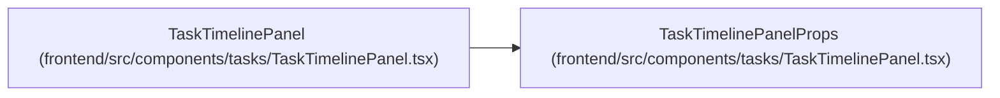

# TaskTimelinePanelProps

**Location:** `frontend/src/components/tasks/TaskTimelinePanel.tsx:17`
**Kind:** Class
**Bases:** —
**Module:** [TaskTimelinePanel](../modules/TaskTimelinePanel.md)

## Description

_Auto-generated from `TaskTimelinePanelProps` in `frontend/src/components/tasks/TaskTimelinePanel.tsx`._

## Attributes

| Name | Type | Default | Description |
|------|------|---------|-------------|
| `task` | `Task` | *required* | — |

## Methods

*No public methods. Inherits from base classes.*

## Relationships

<!-- Auto-generated relationship summary. Do not edit by hand. -->

### Summary

| Module | Methods | Attributes |
|---|---:|---|
| [TaskTimelinePanel](../modules/TaskTimelinePanel.md) | 0 | `task` |

### References

| Reference | Kind | Source | Call sites |
|---|---|---|---:|
| `TaskTimelinePanel` | type_reference | [TaskTimelinePanel](../modules/TaskTimelinePanel.md) | — |
