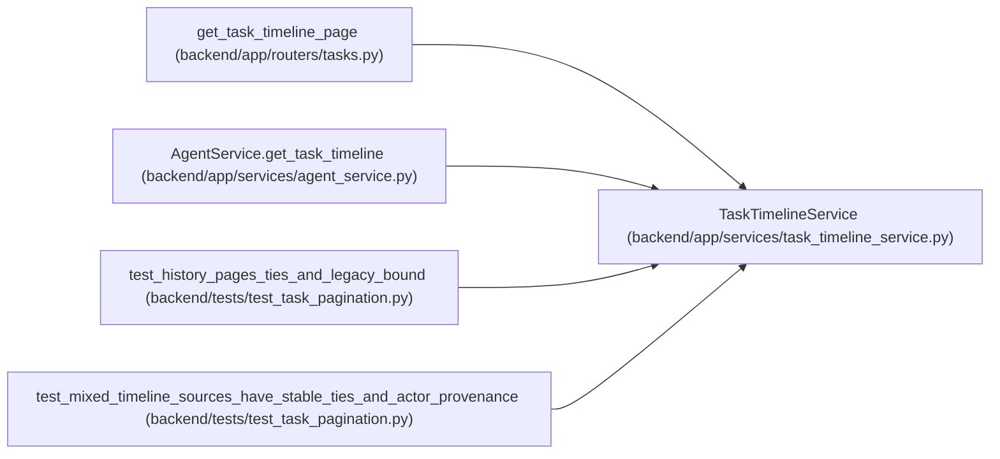

# TaskTimelineService

**Location:** `backend/app/services/task_timeline_service.py:16`
**Kind:** Class
**Bases:** —
**Module:** [task_timeline_service](../modules/task_timeline_service.md)

## Description

_Auto-generated from `TaskTimelineService` in `backend/app/services/task_timeline_service.py`._

## Attributes

*No annotated attributes found.*

## Methods

| Method | Signature | Decorators | Description |
|--------|-----------|------------|-------------|
| `__init__` | `(db, serializer = None)` | — | — |
| `decode` | `(cursor, task_id)` | `@staticmethod` | — |
| `page` | *(async)* `(task_id, *, limit = 50, cursor = None)` | — | — |
| `item` | `(source, row, at)` | — | — |

## Relationships

<!-- Auto-generated relationship summary. Do not edit by hand. -->

### Summary

| Module | Methods | Attributes |
|---|---:|---|
| [task_timeline_service](../modules/task_timeline_service.md) | 4 | — |

### References

| Reference | Kind | Source | Call sites |
|---|---|---|---:|
| `get_task_timeline_page` | call | [tasks](../modules/tasks.md) | 1 |
| `AgentService.get_task_timeline` | call | [agent_service](../modules/agent_service.md) | 1 |
| `test_history_pages_ties_and_legacy_bound` | call | [test_task_pagination](../modules/test_task_pagination.md) | 1 |
| `test_mixed_timeline_sources_have_stable_ties_and_actor_provenance` | call | [test_task_pagination](../modules/test_task_pagination.md) | 1 |
