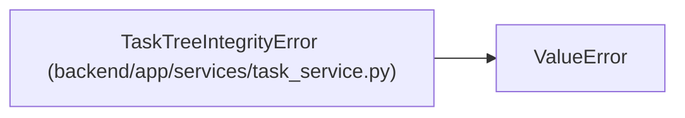

# TaskTreeIntegrityError

**Location:** `backend/app/services/task_service.py:46`
**Kind:** Class
**Bases:** `ValueError`
**Module:** [task_service](../modules/task_service.md)

## Description

Raised when persisted task parent links cannot form a valid iteration tree.

## Attributes

*No annotated attributes found.*

## Methods

*No public methods. Inherits from base classes.*

## Relationships

<!-- Auto-generated relationship summary. Do not edit by hand. -->

### Summary

| Module | Methods | Attributes |
|---|---:|---|
| [task_service](../modules/task_service.md) | 0 | — |

### Structure

| Kind | Entity | Module |
|---|---|---|
| Base | `ValueError` | — |
