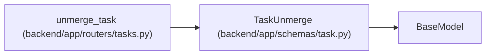

# TaskUnmerge

**Location:** `backend/app/schemas/task.py:268`
**Kind:** Pydantic model
**Bases:** `BaseModel`
**Module:** [schemas_task](../modules/schemas_task.md)

## Description

Request schema for unmerging a parent task.

## Attributes

| Name | Type | Wire name | Required | Nullable | Default | Constraints | Examples | Description |
|------|------|-----------|----------|----------|---------|-------------|-------------|----------|
| `expected_revision` | `Optional[int]` | `expected_revision` | No | Yes | `None` | ge=1 | — | — |
| `delete_parent` | `bool` | `delete_parent` | No | No | `True` | — | — | Delete the parent task after unmerging |

## Methods

*No public methods. Inherits from base classes.*

## Relationships

<!-- Auto-generated relationship summary. Do not edit by hand. -->

### Summary

| Module | Methods | Attributes |
|---|---:|---|
| [schemas_task](../modules/schemas_task.md) | 0 | `delete_parent`, `expected_revision` |

### Structure

| Kind | Entity | Module |
|---|---|---|
| Base | `BaseModel` | — |

### References

| Reference | Kind | Source | Call sites |
|---|---|---|---:|
| `unmerge_task` | type_reference | [tasks](../modules/tasks.md) | — |
