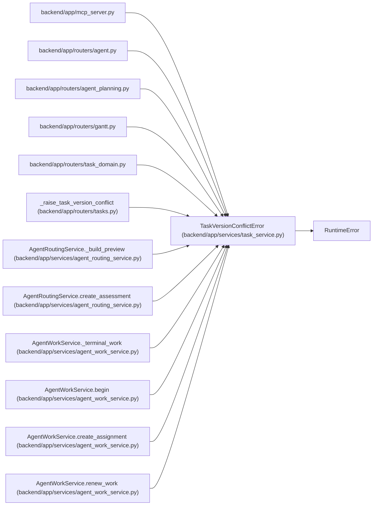

# TaskVersionConflictError

**Location:** `backend/app/services/task_service.py:50`
**Kind:** Class
**Bases:** `RuntimeError`
**Module:** [task_service](../modules/task_service.md)

## Description

Raised when an optimistic task write no longer matches the stored version.

## Attributes

*No annotated attributes found.*

## Methods

| Method | Signature | Decorators | Description |
|--------|-----------|------------|-------------|
| `__init__` | `(expected_version: int, current_task: dict[str, Any])` | — | — |
| `detail` | `() -> dict[str, Any]` | — | Return the stable API conflict envelope. |

## Relationships

<!-- Auto-generated relationship summary. Do not edit by hand. -->

### Summary

| Module | Methods | Attributes |
|---|---:|---|
| [task_service](../modules/task_service.md) | 2 | — |

### Structure

| Kind | Entity | Module |
|---|---|---|
| Base | `RuntimeError` | — |

### References

| Reference | Kind | Source | Call sites |
|---|---|---|---:|
| `mcp_server` | import | [mcp_server](../modules/mcp_server.md) | — |
| `agent` | import | [routers_agent](../modules/routers_agent.md) | — |
| `agent_planning` | import | [routers_agent_planning](../modules/routers_agent_planning.md) | — |
| `gantt` | import | [routers_gantt](../modules/routers_gantt.md) | — |
| `task_domain` | import | [routers_task_domain](../modules/routers_task_domain.md) | — |
| `_raise_task_version_conflict` | type_reference | [tasks](../modules/tasks.md) | — |
| `AgentRoutingService._build_preview` | call | [agent_routing_service](../modules/agent_routing_service.md) | 1 |
| `AgentRoutingService.create_assessment` | call | [agent_routing_service](../modules/agent_routing_service.md) | 1 |
| `AgentWorkService._terminal_work` | call | [agent_work_service](../modules/agent_work_service.md) | 1 |
| `AgentWorkService.begin` | call | [agent_work_service](../modules/agent_work_service.md) | 1 |
| `AgentWorkService.create_assignment` | call | [agent_work_service](../modules/agent_work_service.md) | 1 |
| `AgentWorkService.renew_work` | call | [agent_work_service](../modules/agent_work_service.md) | 1 |

> References: showing 12 of 25 logical references; 13 omitted by the 12-row generated summary limit.
