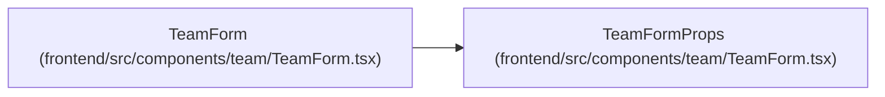

# TeamFormProps

**Location:** `frontend/src/components/team/TeamForm.tsx:13`
**Kind:** Class
**Bases:** —
**Module:** [TeamForm](../modules/TeamForm.md)

## Description

_Auto-generated from `TeamFormProps` in `frontend/src/components/team/TeamForm.tsx`._

## Attributes

| Name | Type | Default | Description |
|------|------|---------|-------------|
| `iterationId` | `number` | *required* | — |
| `initialData` | `TeamMember` | *required* | — |
| `initialProfile` | `TeamMemberProfile` | *required* | — |
| `onSuccess` | `() => void` | *required* | — |
| `onCancel` | `() => void` | *required* | — |
| `onStateChange` | `(state: { dirty: boolean; pending: boolean }) => void` | *required* | — |

## Methods

*No public methods. Inherits from base classes.*

## Relationships

<!-- Auto-generated relationship summary. Do not edit by hand. -->

### Summary

| Module | Methods | Attributes |
|---|---:|---|
| [TeamForm](../modules/TeamForm.md) | 0 | `initialData`, `initialProfile`, `iterationId`, `onCancel`, `onStateChange`, `onSuccess` |

### References

| Reference | Kind | Source | Call sites |
|---|---|---|---:|
| `TeamForm` | type_reference | [TeamForm](../modules/TeamForm.md) | — |
