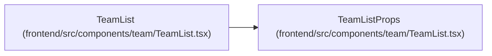

# TeamListProps

**Location:** `frontend/src/components/team/TeamList.tsx:14`
**Kind:** Class
**Bases:** —
**Module:** [TeamList](../modules/TeamList.md)

## Description

_Auto-generated from `TeamListProps` in `frontend/src/components/team/TeamList.tsx`._

## Attributes

| Name | Type | Required | Default | Description |
|------|------|----------|---------|-------------|
| `iterationId` | `number` | Yes | — | — |
| `onEdit` | `(member: TeamMember) => void` | Yes | — | — |

## Methods

*No public methods. Inherits from base classes.*

## Relationships

<!-- Auto-generated relationship summary. Do not edit by hand. -->

### Summary

| Module | Methods | Attributes |
|---|---:|---|
| [TeamList](../modules/TeamList.md) | 0 | `iterationId`, `onEdit` |

### References

| Reference | Kind | Source | Call sites |
|---|---|---|---:|
| `TeamList` | type_reference | [TeamList](../modules/TeamList.md) | — |
