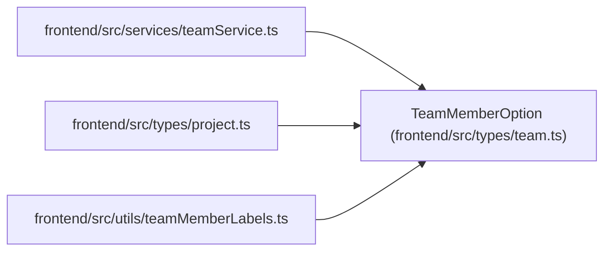

# TeamMemberOption

**Location:** `frontend/src/types/team.ts:124`
**Kind:** Class
**Bases:** —
**Module:** [types_team](../modules/types_team.md)

## Description

_Auto-generated from `TeamMemberOption` in `frontend/src/types/team.ts`._

## Attributes

| Name | Type | Required | Default | Description |
|------|------|----------|---------|-------------|
| `id` | `number` | Yes | — | — |
| `iteration_id` | `number \| null` | No | — | — |
| `iteration_name` | `string \| null` | No | — | — |
| `name` | `string` | Yes | — | — |
| `position` | `string` | Yes | — | — |
| `email` | `string \| null` | No | — | — |

## Methods

*No public methods. Inherits from base classes.*

## Relationships

<!-- Auto-generated relationship summary. Do not edit by hand. -->

### Summary

| Module | Methods | Attributes |
|---|---:|---|
| [types_team](../modules/types_team.md) | 0 | `email`, `id`, `iteration_id`, `iteration_name`, `name`, `position` |

### References

| Reference | Kind | Source | Call sites |
|---|---|---|---:|
| `teamService` | import | [teamService](../modules/teamService.md) | — |
| `project` | import | [types_project](../modules/types_project.md) | — |
| `teamMemberLabels` | import | [teamMemberLabels](../modules/teamMemberLabels.md) | — |
