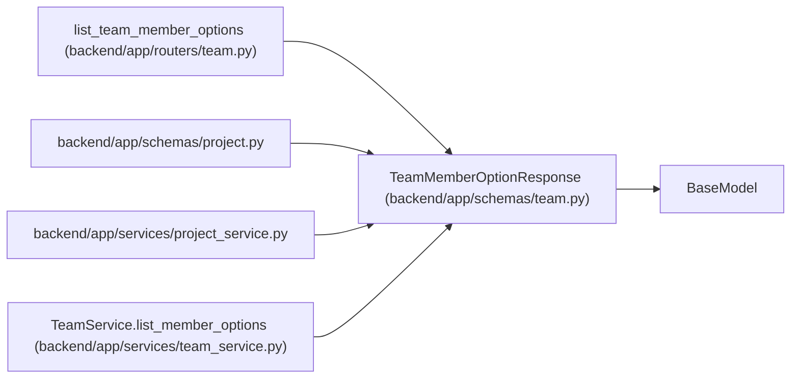

# TeamMemberOptionResponse

**Location:** `backend/app/schemas/team.py:294`
**Kind:** Pydantic model
**Bases:** `BaseModel`
**Module:** [schemas_team](../modules/schemas_team.md)

## Description

Compact team-member identity for owner and assignee selectors.

## Model Configuration

| Setting | Value | Source |
|---------|-------|--------|
| `from_attributes` | `True` | model_config |

## Attributes

| Name | Type | Wire name | Required | Nullable | Default | Constraints | Examples | Description |
|------|------|-----------|----------|----------|---------|-------------|-------------|----------|
| `id` | `int` | `id` | Yes | No | — | — | — | — |
| `iteration_id` | `Optional[int]` | `iteration_id` | No | Yes | `None` | — | — | — |
| `iteration_name` | `Optional[str]` | `iteration_name` | No | Yes | `None` | — | — | — |
| `name` | `str` | `name` | Yes | No | — | — | — | — |
| `position` | `str` | `position` | Yes | No | — | — | — | — |
| `email` | `Optional[str]` | `email` | No | Yes | `None` | — | — | — |

## Methods

*No public methods. Inherits from base classes.*

## Relationships

<!-- Auto-generated relationship summary. Do not edit by hand. -->

### Summary

| Module | Methods | Attributes |
|---|---:|---|
| [schemas_team](../modules/schemas_team.md) | 0 | `email`, `id`, `iteration_id`, `iteration_name`, `name`, `position` |

### Structure

| Kind | Entity | Module |
|---|---|---|
| Base | `BaseModel` | — |

### References

| Reference | Kind | Source | Call sites |
|---|---|---|---:|
| `list_team_member_options` | type_reference | [routers_team](../modules/routers_team.md) | — |
| `project` | import | [schemas_project](../modules/schemas_project.md) | — |
| `project_service` | import | [project_service](../modules/project_service.md) | — |
| `TeamService.list_member_options` | type_reference | [team_service](../modules/team_service.md) | — |
