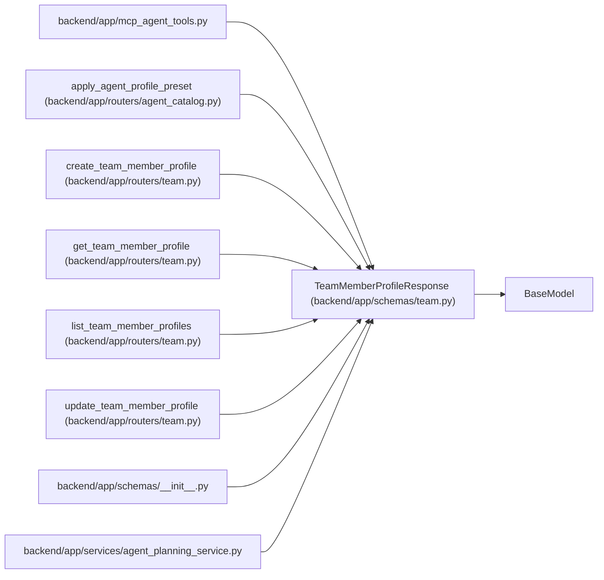

# TeamMemberProfileResponse

**Location:** `backend/app/schemas/team.py:252`
**Kind:** Pydantic model
**Bases:** `BaseModel`
**Module:** [schemas_team](../modules/schemas_team.md)

## Description

Schema for reusable team-member profile responses.

## Model Configuration

| Setting | Value | Source |
|---------|-------|--------|
| `from_attributes` | `True` | model_config |

## Attributes

| Name | Type | Wire name | Required | Nullable | Default | Constraints | Examples | Description |
|------|------|-----------|----------|----------|---------|-------------|-------------|----------|
| `id` | `int` | `id` | Yes | No | — | — | — | — |
| `seed_key` | `Optional[str]` | `seed_key` | No | Yes | `None` | — | — | — |
| `display_name` | `str` | `display_name` | Yes | No | — | — | — | — |
| `email` | `Optional[str]` | `email` | No | Yes | `None` | — | — | — |
| `headline` | `Optional[str]` | `headline` | No | Yes | `None` | — | — | — |
| `summary` | `Optional[str]` | `summary` | No | Yes | `None` | — | — | — |
| `notes` | `Optional[str]` | `notes` | No | Yes | `None` | — | — | — |
| `automation_enabled` | `bool` | `automation_enabled` | Yes | No | — | — | — | — |
| `profile_kind` | `str` | `profile_kind` | No | No | `'human'` | — | — | — |
| `assignment_modes` | `list[str]` | `assignment_modes` | No | No | factory: `list` | — | — | — |
| `skills` | `list[TeamMemberProfileSkillResponse]` | `skills` | No | No | factory: `list` | — | — | — |
| `created_at` | `datetime` | `created_at` | Yes | No | — | — | — | — |
| `updated_at` | `datetime` | `updated_at` | Yes | No | — | — | — | — |

## Methods

*No public methods. Inherits from base classes.*

## Relationships

<!-- Auto-generated relationship summary. Do not edit by hand. -->

### Summary

| Module | Methods | Attributes |
|---|---:|---|
| [schemas_team](../modules/schemas_team.md) | 0 | `assignment_modes`, `automation_enabled`, `created_at`, `display_name`, `email`, `headline`, `id`, `notes`, `profile_kind`, `seed_key`, `skills`, `summary` |

### Structure

| Kind | Entity | Module |
|---|---|---|
| Base | `BaseModel` | — |

### References

| Reference | Kind | Source | Call sites |
|---|---|---|---:|
| `mcp_agent_tools` | import | [mcp_agent_tools](../modules/mcp_agent_tools.md) | — |
| `apply_agent_profile_preset` | type_reference | [agent_catalog](../modules/agent_catalog.md) | — |
| `create_team_member_profile` | type_reference | [routers_team](../modules/routers_team.md) | — |
| `get_team_member_profile` | type_reference | [routers_team](../modules/routers_team.md) | — |
| `list_team_member_profiles` | type_reference | [routers_team](../modules/routers_team.md) | — |
| `update_team_member_profile` | type_reference | [routers_team](../modules/routers_team.md) | — |
| `__init__` | import | [schemas___init__](../modules/schemas___init__.md) | — |
| `agent_planning_service` | import | [agent_planning_service](../modules/agent_planning_service.md) | — |
