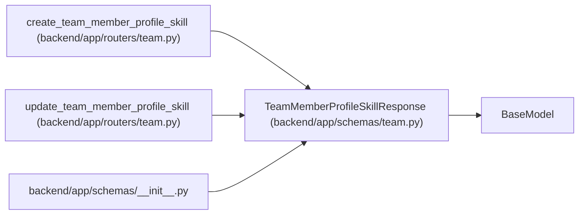

# TeamMemberProfileSkillResponse

**Location:** `backend/app/schemas/team.py:168`
**Kind:** Pydantic model
**Bases:** `BaseModel`
**Module:** [schemas_team](../modules/schemas_team.md)

## Description

Schema for profile skill responses.

## Model Configuration

| Setting | Value | Source |
|---------|-------|--------|
| `from_attributes` | `True` | model_config |

## Attributes

| Name | Type | Wire name | Required | Nullable | Default | Constraints | Examples | Description |
|------|------|-----------|----------|----------|---------|-------------|-------------|----------|
| `id` | `int` | `id` | Yes | No | — | — | — | — |
| `profile_id` | `int` | `profile_id` | Yes | No | — | — | — | — |
| `skill_key` | `str` | `skill_key` | Yes | No | — | — | — | — |
| `skill_name` | `str` | `skill_name` | Yes | No | — | — | — | — |
| `category` | `Optional[str]` | `category` | No | Yes | `None` | — | — | — |
| `level` | `int` | `level` | Yes | No | — | — | — | — |
| `interest` | `int` | `interest` | Yes | No | — | — | — | — |
| `is_weakness` | `bool` | `is_weakness` | Yes | No | — | — | — | — |
| `keywords_json` | `list[str]` | `keywords_json` | No | No | factory: `list` | — | — | — |
| `notes` | `Optional[str]` | `notes` | No | Yes | `None` | — | — | — |
| `created_at` | `datetime` | `created_at` | Yes | No | — | — | — | — |
| `updated_at` | `datetime` | `updated_at` | Yes | No | — | — | — | — |

## Methods

*No public methods. Inherits from base classes.*

## Relationships

<!-- Auto-generated relationship summary. Do not edit by hand. -->

### Summary

| Module | Methods | Attributes |
|---|---:|---|
| [schemas_team](../modules/schemas_team.md) | 0 | `category`, `created_at`, `id`, `interest`, `is_weakness`, `keywords_json`, `level`, `notes`, `profile_id`, `skill_key`, `skill_name`, `updated_at` |

### Structure

| Kind | Entity | Module |
|---|---|---|
| Base | `BaseModel` | — |

### References

| Reference | Kind | Source | Call sites |
|---|---|---|---:|
| `create_team_member_profile_skill` | type_reference | [routers_team](../modules/routers_team.md) | — |
| `update_team_member_profile_skill` | type_reference | [routers_team](../modules/routers_team.md) | — |
| `__init__` | import | [schemas___init__](../modules/schemas___init__.md) | — |
